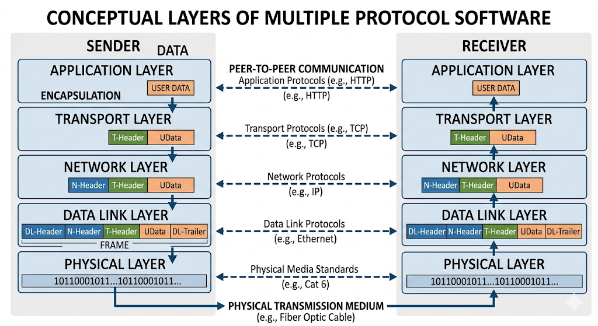

## Conceptual Layers of Multiple Protocol Software

In computer networking, the complexity of communication is managed by breaking the process down into a vertical stack of **conceptual layers**. Each layer is responsible for a specific part of the communication process and provides services to the layer above it while hiding the technical details of how those services are implemented.

### 1. Protocol Layering Principles
For a layered architecture to function effectively, it must follow specific design principles (often based on the ISO/OSI model or the TCP/IP suite):

*   **Layer Independence (Modularization):** Each layer should be designed to perform a well-defined function. Changes made to the internal implementation of one layer should not affect other layers, provided the interfaces remain the same.
*   **Vertical Service Provider Model:** A layer $N$ uses the services provided by the layer immediately below it (Layer $N-1$) and provides services to the layer immediately above it (Layer $N+1$).
*   **Horizontal Peer-to-Peer Communication:** While data flows vertically, each layer on the sending machine logically communicates with the same layer on the receiving machine. This is governed by **Protocols**.
*   **Encapsulation:** As data moves down the layers at the sender's end, each layer adds its own control information (headers/trailers). This process is reversed (decapsulation) at the receiver’s end.

---

### 2. The Conceptual Layers (The Five-Layer Model)
For university exams, the five-layer Internet model is the most practical framework to describe these conceptual layers:

#### A. Application Layer
*   **Function:** This is the top layer that interacts directly with the end-user or software applications.
*   **Responsibility:** It handles network services like file transfers, web browsing, and email.
*   **Protocols:** HTTP (Web), FTP (File Transfer), SMTP (Email), DNS.

#### B. Transport Layer
*   **Function:** Provides end-to-end communication services for applications.
*   **Responsibility:** It manages **Segmentation** (breaking data into smaller pieces), **Error Control**, and **Flow Control**. It is also responsible for the multiplexing and demultiplexing we discussed earlier.
*   **Protocols:** TCP (Reliable), UDP (Fast/Connectionless).

#### C. Network Layer (Internet Layer)
*   **Function:** Responsible for moving packets from the source host to the destination host across multiple networks.
*   **Responsibility:** Its primary roles are **Routing** (choosing the best path) and **Logical Addressing** (IP addresses).
*   **Protocols:** IP (IPv4/IPv6), ICMP, ARP.

#### D. Data Link Layer
*   **Function:** Responsible for moving "frames" from one node to the next over a single physical link.
*   **Responsibility:** It handles **Physical Addressing** (MAC addresses), framing, and media access control. It ensures that the physical link appears error-free to the network layer.
*   **Protocols:** Ethernet, Wi-Fi (802.11), PPP.

#### E. Physical Layer
*   **Function:** The lowest layer, dealing with the actual mechanical and electrical transmission of raw bits.
*   **Responsibility:** It defines bit-rate control, signal voltage levels, cable specifications, and connector types.
*   **Examples:** Fiber optics, Coaxial cable, Twisted-pair (Category 6).

---

## DATA link layer in detail"

The Data Link Layer (Layer 2) is often considered the most critical "bridge" between the software-driven world of networking and the physical hardware. While the Network Layer handles getting a packet across the globe, the Data Link Layer handles getting it from one specific machine to the next immediate machine in the path.

Think of the **Data Link Layer** as the "Local Delivery Service." While the Network Layer handles the overall route, this layer handles the actual physical hop from one device to the next.

### Core Functions (Briefly)
*   **Framing:** Wraps packets into "frames" with a header and trailer to mark where data starts and ends.
*   **Physical (MAC) Addressing:** Uses the hardware’s unique MAC address to identify the specific machine on a local network.
*   **Media Access Control:** Acts as a traffic cop to prevent multiple devices from "talking" at once and causing signal collisions.
*   **Error Detection:** Checks the frame for corruption during transmission using a math-based checksum; if it's broken, it’s dropped.

### Real-World Example
If you are sending an email, your **IP address** is your home address (Network Layer), but your **MAC address** is your specific laptop's serial number (Data Link Layer).

### Common Protocols
*   **Ethernet:** For wired connections.
*   **Wi-Fi (802.11):** For wireless connections.
*   **PPP:** For direct point-to-point links. (PPP: Point-to-Point Protocol)