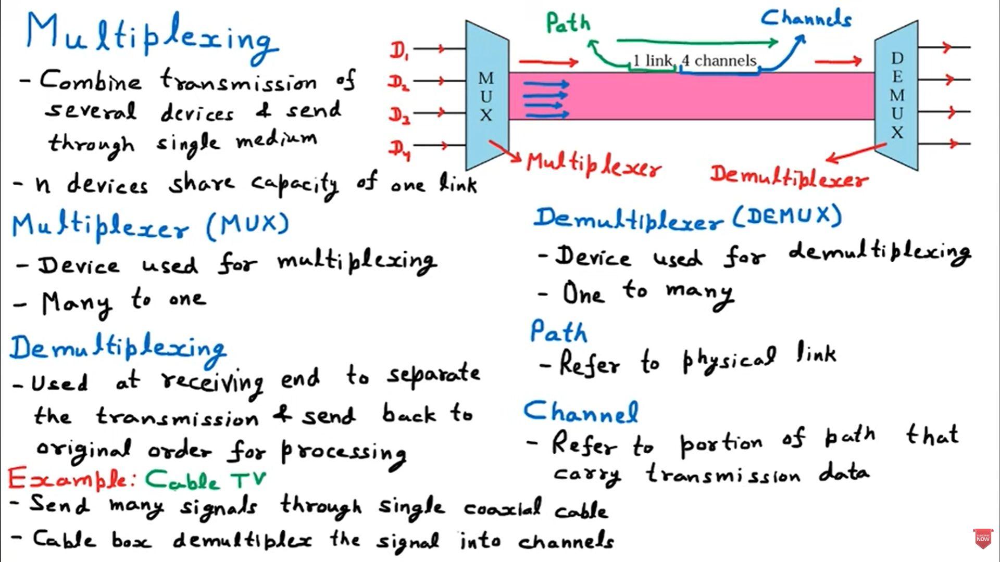
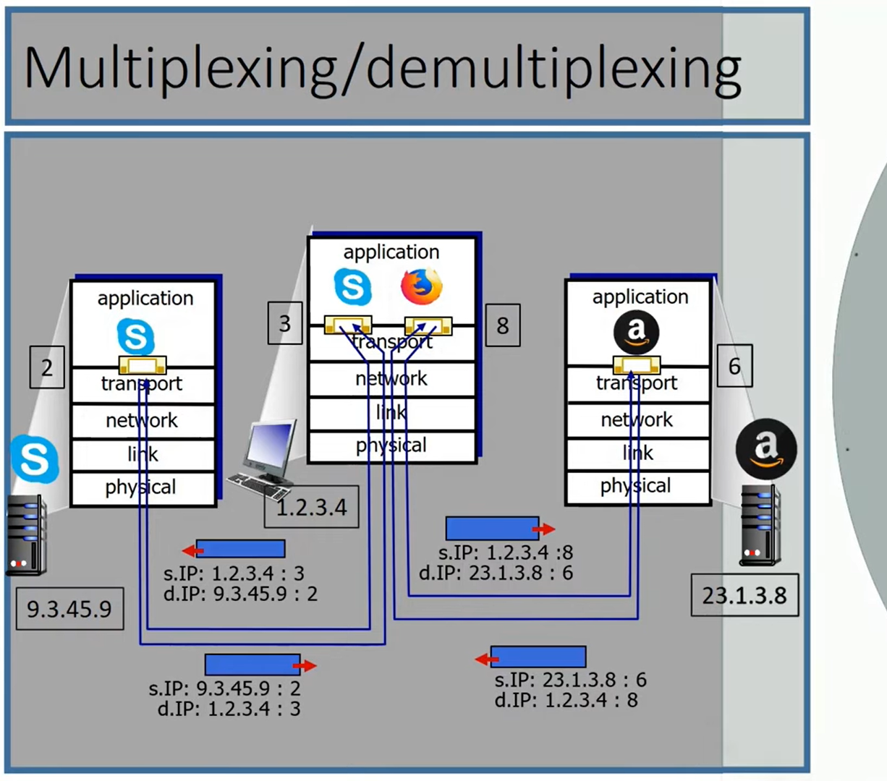

In computer networks, multiplexing and demultiplexing are the mechanisms that allow multiple communication sessions to share a single physical medium or network link. Think of it as the "traffic management" system that ensures data from different applications gets to the right destination without getting mixed up.

---

## 1. Multiplexing (The "Combining" Phase)
Multiplexing happens at the **sender's side**. It is the process of gathering data chunks from different application processes, wrapping them with header information (to create segments), and passing them onto the network layer.

### How it works:
1.  The transport layer collects data from various sockets (ports).
2.  It adds a header containing a **Source Port Number** and a **Destination Port Number**.
3.  These segments are then sent as a single stream through the network.

---

## 2. Demultiplexing (The "Delivering" Phase)
Demultiplexing happens at the **receiver's side**. It is the process of receiving segments from the network layer and delivering the data to the correct application process.

### How it works:
1.  The receiver's transport layer examines the **Destination Port Number** in the incoming segment.
2.  It identifies the specific socket associated with that port.
3.  The data is then directed to the corresponding application.

---

## A Concrete Example: The Browser Scenario
Imagine you are sitting at your laptop and doing two things simultaneously:
1.  **Tab 1:** You are streaming a video on YouTube.
2.  **Tab 2:** You are chatting with a friend on a web-based messenger.

### At the Sender (Server Side):
The YouTube server and the Messenger server are sending data to your IP address. On their end, the transport layer **multiplexes** these distinct data streams into segments, marking them with different port numbers (e.g., Port 443 for HTTPS traffic).

### At the Receiver (Your Laptop):
Your computer receives a constant stream of packets from the internet. Without demultiplexing, the video data might end up in your chat window, and your messages might try to play as video.
*   The **Transport Layer** looks at the segment.
*   It sees "Port A" and sends that data to the **YouTube Tab**.
*   It sees "Port B" and sends that data to the **Messenger Tab**.

---

## Key Differences

| Feature | Multiplexing | Demultiplexing |
| :--- | :--- | :--- |
| **Location** | Source/Sender | Destination/Receiver |
| **Action** | Combining multiple streams | Separating a single stream |
| **Identifier** | Uses Port Numbers to "label" | Uses Port Numbers to "route" |
| **Goal** | Efficient use of the transmission medium | Accurate delivery to the application |

### Protocol Context
In the TCP/IP suite:
*   **UDP** demultiplexing uses only the **Destination Port Number** and IP.
*   **TCP** demultiplexing is more specific; it uses a **4-tuple** (Source IP, Source Port, Destination IP, Destination Port) to ensure that even if two different people are accessing the same web server, their data stays separate.