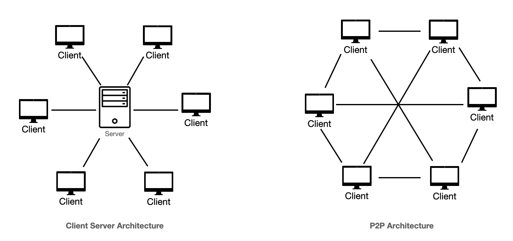

A **peer-to-peer (P2P) protocol** is a way for computers (called *peers*) to communicate and share resources directly with each other, without relying on a central server. Instead of a single authority managing everything, each participant acts both as a **client** (requesting data) and a **server** (providing data).

---

## 🔹 1. Basic Idea

In traditional client-server systems (like visiting a website), your computer asks a central server for data. In P2P systems, every computer in the network can:

* Request data from others
* Send data to others

So the network is **decentralized**.

---

## 🔹 2. Key Characteristics

### a) Decentralization

No single central server controls the network. This improves:

* Fault tolerance (no single point of failure)
* Scalability

### b) Distributed Resources

Files, bandwidth, and processing power are shared across all peers.

### c) Self-Organization

Peers can join and leave the network freely, and the system adapts dynamically.

---

## 🔹 3. Types of P2P Architectures

### 1. Pure P2P

* No central coordination at all
* All peers are equal
* Example: early versions of **Gnutella**

### 2. Hybrid P2P

* Uses a central server for indexing/search
* Data transfer still happens between peers
* Example: **Napster**

### 3. Structured P2P

* Uses algorithms like Distributed Hash Tables (DHT)
* Efficient lookup of resources
* Example: **BitTorrent**

---

## 🔹 4. How P2P Protocols Work (Step-by-Step)

Let’s take file sharing as an example:

### Step 1: Peer Discovery

* A peer joins the network
* It finds other peers via:

  * Bootstrapping servers
  * Known peer lists

### Step 2: Resource Discovery

* The peer searches for a file
* In structured systems, this uses hashing (DHT)

### Step 3: Connection Establishment

* The requesting peer connects directly to peers who have the file

### Step 4: Data Transfer

* File is split into chunks
* Download happens from multiple peers simultaneously

### Step 5: Upload (Sharing)

* While downloading, the peer also uploads chunks to others

---

## 🔹 5. Important Concepts

### a) Distributed Hash Table (DHT)

A method to store and retrieve data across nodes efficiently without a central directory.

### b) Swarming

Used in systems like BitTorrent:

* Many peers share different pieces of the same file simultaneously

### c) Seeding and Leeching

* **Seeder**: Has full file and uploads
* **Leecher**: Downloading file (may also upload parts)

---

## 🔹 6. Advantages

* High scalability
* Efficient resource usage
* No single point of failure
* Faster downloads (parallel sharing)

---

## 🔹 7. Disadvantages

* Security risks (malicious peers)
* Harder to manage/control
* Legal issues (copyright violations in file sharing)
* Data consistency challenges

---

## 🔹 8. Real-World Applications

* File sharing (BitTorrent)
* Cryptocurrencies like **Bitcoin**
* VoIP apps (e.g., early **Skype**)
* Distributed computing systems

---

## 🔹 9. P2P vs Client-Server (Quick Comparison)

| Feature     | P2P                      | Client-Server     |
| ----------- | ------------------------ | ----------------- |
| Control     | Decentralized            | Centralized       |
| Reliability | High (no single failure) | Depends on server |
| Scalability | Very high                | Limited by server |
| Maintenance | Complex                  | Easier            |

---

## 🔹 10. Simple Analogy

Think of P2P like a group study:

* Everyone shares notes with each other
* No single person is responsible for everything

Whereas client-server is like:

* One teacher gives notes to all students

---

If you want, I can go deeper into **BitTorrent internals, DHT algorithms, or real packet-level communication**.
