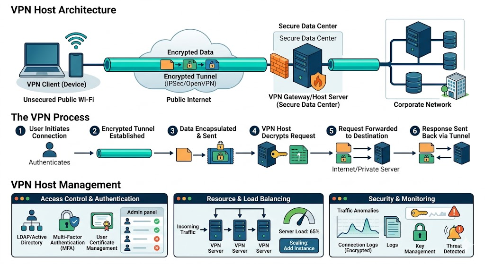

## Understanding Virtual Private Networks (VPNs)

A **Virtual Private Network (VPN)** is a service that establishes a secure, encrypted connection between your device and the internet. It acts as a private "tunnel" through the public internet, masking your IP address and encrypting all data transmitted through it.

### Why is a VPN Needed?

VPNs serve several critical functions for both individuals and organizations:

*   **Privacy and Anonymity:** By routing your traffic through a remote server, a VPN hides your actual IP address. Websites see the VPN server's IP instead, making it harder for advertisers and ISPs to track your browsing habits.
*   **Security on Public Wi-Fi:** Public networks (like those in cafes or airports) are often unencrypted and vulnerable to "man-in-the-middle" attacks. A VPN encrypts your connection, protecting sensitive data like passwords and credit card numbers.
*   **Bypassing Geo-Restrictions:** Many streaming services and websites restrict content based on location. A VPN allows you to "spoof" your location by connecting to a server in a different country.
*   **Remote Work Access:** For businesses, a VPN allows employees to securely access the internal company network and private files while working from home or traveling.

---

## VPN Host Management

**VPN Host Management** refers to the administration, configuration, and maintenance of the server (the "host") that facilitates VPN connections. Proper management ensures that the network remains secure, scalable, and high-performing.

### Core Components of Host Management

1.  **Authentication and Access Control:**
    Management involves defining who can connect to the host. This often includes **Multi-Factor Authentication (MFA)**, digital certificates, or integration with directory services like LDAP or Active Directory to manage user permissions.

2.  **Protocol Selection:**
    The host administrator must choose the appropriate tunneling protocol based on the balance between speed and security. Common protocols include:
    *   **OpenVPN:** Highly secure and open-source.
    *   **WireGuard:** A modern, high-performance protocol with streamlined code.
    *   **IPsec/IKEv2:** Excellent for mobile stability.

3.  **Load Balancing and Scaling:**
    As the number of users increases, a single host may become a bottleneck. Management involves distributing traffic across multiple servers (Load Balancing) or spinning up virtual instances to handle peak loads.

4.  **Logging and Monitoring:**
    Administrators monitor the host for unusual traffic patterns that might indicate a security breach. While many commercial VPNs claim a "no-logs" policy, corporate VPN hosts usually log connection times and bandwidth usage for auditing purposes.

5.  **IP Address Management (IPAM):**
    The host must assign internal IP addresses to each connected client. Management ensures that there are no IP conflicts and that the internal subnet is correctly routed to the internet or the private corporate network.

---

## Detailed VPN Architecture

The architecture typically involves a **Client**, a **VPN Gateway (Host)**, and the **Target Network/Internet**.

### How it Works:
1.  **The Handshake:** The client initiates a connection to the VPN host. They negotiate encryption keys and authenticate the user's identity.
2.  **Encapsulation:** The original data packet is "wrapped" inside another packet. This is the "tunneling" process.
3.  **Encryption:** The host and client use a symmetric key to encrypt the payload.
4.  **The Host Relay:** The VPN host receives the encrypted packet, decrypts it, and forwards the original request to the intended destination (e.g., a website or a private server).
5.  **The Return Path:** The process repeats in reverse for data coming back to the user.