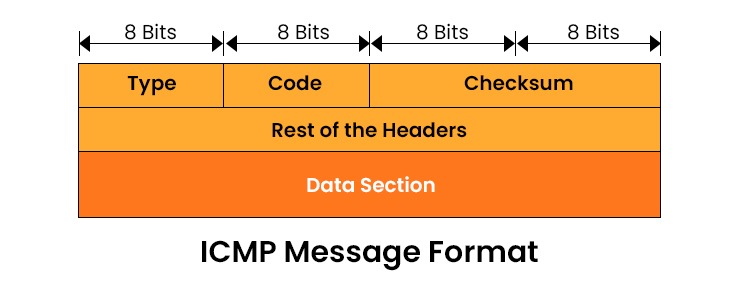
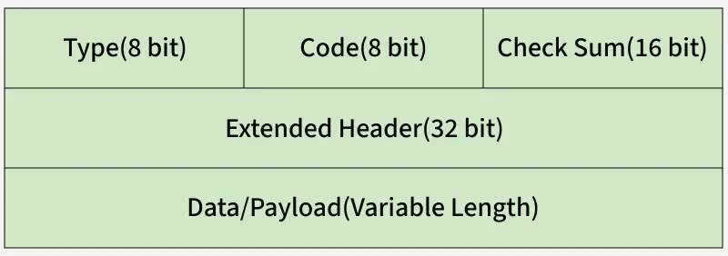

## Internet Control Message Protocol (ICMP)

The **Internet Control Message Protocol (ICMP)** is a fundamental network layer protocol used by network devices (like routers) and hosts to diagnose communication issues and send error messages. Unlike TCP or UDP, ICMP is not typically used to exchange user data between systems; rather, it acts as a "management" layer for the Internet Protocol (IP).

---
# Internet Control Message Protocol (ICMP)

Last Updated : 10 Oct, 2025

---

## Internet Control Message Protocol (ICMP)

Internet Control Message Protocol (ICMP) is a network layer protocol widely used by network devices such as routers, gateways and hosts to send error messages and operational information. Since the Internet Protocol (IP) itself does not have an inbuilt error-reporting or correction mechanism, ICMP is a supporting protocol within the IP suite that helps in reporting errors and sending diagnostic messages. It is primarily used for:

Error reporting: When data packets cannot reach their destination due to issues such as unreachable hosts, timeouts or fragmentation errors.  
Operational queries: For example, echo requests and replies used in tools like ping.

Note: Without ICMP, devices would not be able to inform the sender about delivery failures, congestion or misrouting, making network troubleshooting almost impossible.

---

## Uses of ICMP

### Error Reporting
If a message cannot be delivered, ICMP informs the source about the failure.  
Example: If a packet is too large and cannot be forwarded, the receiver drops the packet and sends an ICMP error message to the sender.

### Network Diagnostics
Traceroute: Used to determine the path packets take across routers to reach the destination.  
Ping: Sends echo-request and echo-reply messages to measure round-trip time and test connectivity.

---

## How ICMP Works

ICMP is connectionless (unlike TCP) and does not require a handshake.  
Messages are encapsulated within IP datagrams, consisting of an IP header followed by an ICMP header and payload.  
Devices send ICMP packets when encountering errors such as unreachable hosts, expired time-to-live (TTL) or routing issues.

---

## ICMP Packet Format

### Type (8-bit)
The initial 8-bit of the packet is for message type, it provides a brief description of the message so that receiving network would know what kind of message it is receiving and how to respond to it. Some common message types are as follows:  
Type 0 - Echo reply  
Type 3 - Destination unreachable  
Type 5 - Redirect Message  
Type 8 - Echo Request  
Type 11 - Time Exceeded  
Type 12 - Parameter problem  

### Code (8-bit)
Code is the next 8 bits of the ICMP packet format, this field carries some additional information about the error message and type.

### Checksum (16-bit)
Last 16 bits are for the checksum field in the ICMP packet header. The checksum is used to check the number of bits of the complete message and enable the ICMP tool to ensure that complete data is delivered.

The next 32 bits of the ICMP Header are Extended Header which has the work of pointing out the problem in IP Message. Byte locations are identified by the pointer which causes the problem message and receiving device looks here for pointing to the problem.

The last part of the ICMP packet is Data or Payload of variable length. The bytes included in IPv4 are 576 bytes and in IPv6, 1280 bytes.

### Header Fields:
*   **Type (8 bits):** Defines the high-level category of the ICMP message (e.g., Echo Request, Destination Unreachable).
*   **Code (8 bits):** Provides specific details about the message type (e.g., why a destination is unreachable).
*   **Checksum (16 bits):** Used to check for errors in the ICMP message.
*   **Rest of Header (32 bits):** Varies depending on the message type (e.g., contains Identifier and Sequence Number for Ping).

---

## Common ICMP Message Types

| Type | Name | Purpose | Use Case |
| :--- | :--- | :--- | :--- |
| **0 / 8** | **Echo Reply / Request** | Tests reachability between two hosts. | Used by the `ping` command. |
| **3** | **Destination Unreachable** | Informs the sender that the packet could not be delivered. | Router cannot find a path to the IP. |
| **5** | **Redirect** | Suggests a better first-hop router for a specific destination. | Optimizing routing paths on a local network. |
| **11** | **Time Exceeded** | Sent when a packet's Time-to-Live (TTL) reaches zero. | Used by the `traceroute` command. |
| **12** | **Parameter Problem** | Indicates a header error in the original IP packet. | Dealing with corrupted or invalid IP headers. |

---

## ICMP in Troubleshooting Tools

### 1. Ping
`ping` is the most common tool for testing basic connectivity. 
*   **How it works:** The source sends an **ICMP Echo Request** (Type 8) to a target IP.
*   **The Response:** If the target is alive and reachable, it responds with an **ICMP Echo Reply** (Type 0). 
*   **Result:** The tool measures the Round Trip Time (RTT) and packet loss.

### 2. Traceroute
`traceroute` maps the path a packet takes to reach a destination.
*   **How it works:** It sends a sequence of packets (usually UDP or ICMP) with an increasing **TTL (Time-to-Live)** value, starting at 1.
*   **The Hop:** The first router decrements the TTL to 0, drops the packet, and sends back an **ICMP Time Exceeded** (Type 11) message. 
*   **Mapping:** This reveals the router's identity. The process repeats (TTL 2, TTL 3, etc.) until the destination is reached.

---

## Limitations and Security Concerns

While vital for health checks, ICMP is often restricted in modern security-conscious environments due to several risks:

### Security Vulnerabilities:
*   **ICMP Flood (DDoS):** An attacker sends a massive volume of ICMP Echo Requests to a target to overwhelm its resources and crash the system.
*   **Smurf Attack:** An attacker sends ICMP requests to a broadcast address with a spoofed source IP (the victim’s IP), causing every host on the network to flood the victim with replies.
*   **Network Reconnaissance:** Attackers use `ping` sweeps or `traceroute` to map out internal network topologies and identify live hosts.

### Modern Implementation:
Because of these threats, many firewalls and corporate networks are configured to **block ICMP traffic** by default. While this improves security, it can make troubleshooting significantly harder, as tools like `ping` will appear to time out even if the destination is actually online.

To understand ICMP fully, you have to look at the **Type** and **Code** fields. While the "Type" defines the broad category of the message, the "Code" provides the specific reason why that message was generated.

---

### 1. Echo Request (Type 8) and Echo Reply (Type 0)
These are the most recognized ICMP messages, forming the backbone of the `ping` utility.
*   **Purpose:** To verify if a specific IP address is reachable and how long it takes for a packet to return.
*   **Mechanism:** When you ping a server, your computer sends an **Echo Request**. The receiving device, if configured to respond, swaps the source and destination addresses and sends back an **Echo Reply**.
*   **Format:** These messages include an **Identifier** and a **Sequence Number** in the header to help the sender match requests with their specific replies.

### 2. Destination Unreachable (Type 3)
This message is generated by a router or the destination host itself when a packet cannot be delivered. The **Code** field is vital here to diagnose the failure:
*   **Code 0 (Net Unreachable):** The router has no route to the destination network.
*   **Code 1 (Host Unreachable):** The local delivery to the specific host failed (often an ARP failure).
*   **Code 3 (Port Unreachable):** The packet reached the host, but the specific transport protocol port (TCP/UDP) is not active or is blocked.
*   **Code 4 (Fragmentation Needed):** The packet is too large for the next link, but the "Don't Fragment" (DF) bit is set in the IP header.

### 3. Redirect (Type 5)
Redirects are used by routers to inform a host that there is a more efficient path available.
*   **Use Case:** If a host sends a packet to Router A, but Router A knows that Router B is on the same local segment and is the actual "best" next hop for that destination, Router A will forward the packet and send an **ICMP Redirect** to the host.
*   **Modern Note:** For security reasons, many modern operating systems ignore ICMP Redirects to prevent "Man-in-the-Middle" attacks where a malicious actor redirects traffic through their own device.

### 4. Time Exceeded (Type 11)
This is the "safety valve" of the internet, preventing packets from looping forever.
*   **Code 0 (TTL Expired in Transit):** Every IP packet has a Time-to-Live (TTL) value. Each router it passes through subtracts 1. If the TTL hits 0, the router drops the packet and sends this ICMP message back to the sender.
*   **Traceroute Logic:** `traceroute` intentionally sends packets with a TTL of 1, then 2, then 3. By forcing these "Time Exceeded" errors, it identifies every router in the path.

### 5. Parameter Problem (Type 12)
This is a "catch-all" for errors that don't fit other categories, specifically regarding the IP header itself.
*   **Purpose:** If a router or host discovers a structural error in the IP header that prevents it from processing the packet, it sends this message.
*   **Detail:** The ICMP data field often includes a **Pointer** that identifies the exact byte offset in the original header where the error was detected.

---

### Summary Table of Codes
| Type | Code | Meaning |
| :--- | :--- | :--- |
| **3** | 0 | Network Unreachable |
| **3** | 1 | Host Unreachable |
| **3** | 3 | Port Unreachable |
| **11** | 0 | TTL expired in transit |
| **11** | 1 | Fragment reassembly time exceeded |

Does the logic behind how `traceroute` manipulates the TTL make sense, or would you like to dive deeper into that specific mechanism?