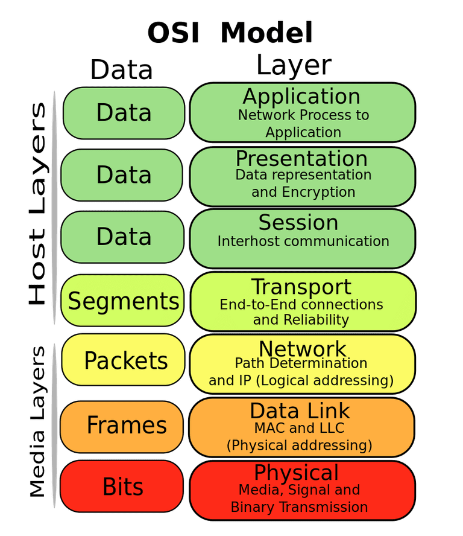

---

# **OSI Model (Open Systems Interconnection Model)**

---

## **1. Definition**

**OSI (Open Systems Interconnection) Model** is a **conceptual framework** that standardizes the functions of a telecommunication or computing system **into seven distinct layers**.

* It is **not a protocol**, but a **reference model** used to **understand and design network systems**.
* Helps ensure **interoperability between different vendors and technologies**.

> **In simple terms:** OSI is like a “blueprint” that defines **how data travels from one computer to another over a network**.

---

## **2. Importance of OSI Model**

1. **Standardization**: Provides a universal language for network communication.
2. **Troubleshooting**: Helps isolate problems at specific layers.
3. **Interoperability**: Devices from different vendors can communicate.
4. **Modular Design**: Each layer handles specific tasks, making systems easier to design and maintain.

---

## **3. OSI Layers**

The OSI model has **seven layers**, from **top (closest to user) to bottom (physical transmission)**:

| Layer                     | Abbreviation | Function                                                                                              | Key Devices/Protocols      |
| ------------------------- | ------------ | ----------------------------------------------------------------------------------------------------- | -------------------------- |
| **7. Application Layer**  | -            | Provides network services directly to user applications (email, web browsing, file transfer)          | HTTP, FTP, SMTP, DNS       |
| **6. Presentation Layer** | -            | Translates data into a standard format, handles encryption, compression, and data conversion          | SSL/TLS, JPEG, ASCII, MPEG |
| **5. Session Layer**      | -            | Manages sessions (connections) between applications, ensures proper start, stop, and synchronization  | NetBIOS, RPC               |
| **4. Transport Layer**    | TCP/UDP      | Provides reliable (TCP) or unreliable (UDP) delivery, error checking, segmentation                    | TCP, UDP                   |
| **3. Network Layer**      | IP           | Responsible for logical addressing and routing of data between networks                               | IP, ICMP, Routers          |
| **2. Data Link Layer**    | -            | Handles physical addressing (MAC), error detection/correction, and frame delivery over physical media | Ethernet, Switches, ARP    |
| **1. Physical Layer**     | -            | Deals with actual transmission of raw bits over the physical medium                                   | Cables, Hubs, Fiber optics |

---

## **4. How Data Travels in OSI (Encapsulation)**

1. **Sending Side (Encapsulation)**:

   * Data created by the application → goes down each layer → each layer adds its **header (and sometimes trailer)** → finally sent as bits over the physical medium.

2. **Receiving Side (Decapsulation)**:

   * Receiver gets bits → Physical layer → Data Link → Network → Transport → Application → Original message delivered.

> Think of it like **sending a letter inside envelopes**:
>
> * Application = your letter
> * Transport = envelope with tracking
> * Network = postal routing info
> * Data Link/Physical = the actual postal delivery system

---

## **5. Summary**

* The **OSI model** is a **7-layer reference model** that explains how data moves from one system to another.
* Layers are **modular**, each with **specific tasks**: Application → Presentation → Session → Transport → Network → Data Link → Physical.
* Helps **design, troubleshoot, and understand networks**.
* Though modern Internet uses **TCP/IP stack**, OSI is still widely used **conceptually and in teaching**.

---

If you want, I can also make a **colorful OSI layer diagram with functions, protocols, and examples** that is **perfect for exams**.

Do you want me to create that diagram?
