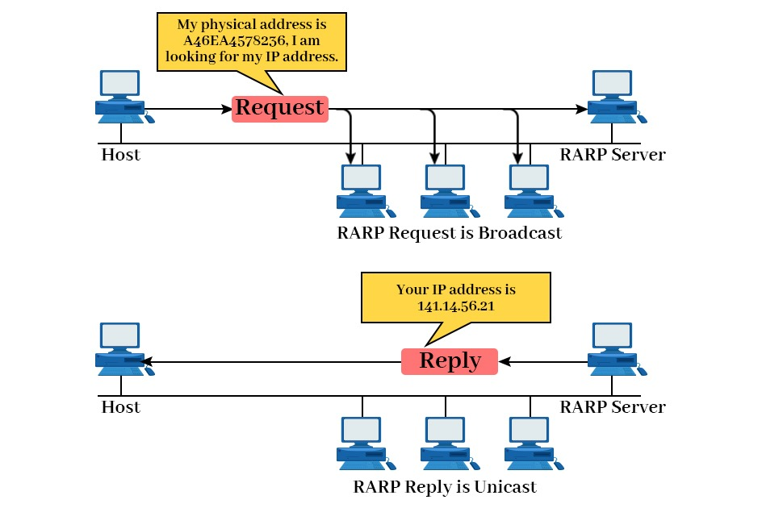

---

# **Reverse Address Resolution Protocol (RARP)**

---

### **1. Definition**

**RARP (Reverse Address Resolution Protocol)** is a **network protocol used to map a known MAC address (physical address) to a corresponding IP address (logical address)**.

* Works in **Layer 2 (Data Link)** and interacts with Layer 3 (Network) of the OSI model.
* Essentially the **reverse of ARP**, which maps IP → MAC.
* Historically used for **diskless workstations** that know their hardware address but **do not have an IP address**.

> **In simple words:** RARP answers the question:
> “I know my MAC address, but what is my IP address?”

---

### **2. Purpose of RARP**

1. **Assign IP addresses to diskless clients:**

   * Devices like thin clients or diskless workstations boot from the network.
   * They only know their MAC address and need an IP to communicate.

2. **Enable network booting:**

   * Used to initialize devices on the network before they have configuration files.

3. **Dynamic IP assignment for hardware without storage:**

   * Early method before DHCP became standard.

---

### **3. How RARP Works**

1. **Request Phase:**

   * The client sends a **RARP Request** containing its **MAC address** to a RARP server on the network.
   * Broadcast is used because the client doesn’t yet know its network configuration.

2. **Reply Phase:**

   * The RARP server receives the request, looks up its **RARP table**, and finds the corresponding IP address.
   * The server sends a **RARP Reply** with the assigned IP to the client.

3. **Client Configuration:**

   * The client receives its IP address and can now participate in the network using TCP/IP.

---

### **4. RARP Packet Format**

RARP uses a packet format similar to ARP:

| **Field**                      | **Size** | **Description**                        |
| ------------------------------ | -------- | -------------------------------------- |
| Hardware Type (HTYPE)          | 16 bits  | Type of hardware (Ethernet = 1)        |
| Protocol Type (PTYPE)          | 16 bits  | Type of protocol (IPv4 = 0x0800)       |
| Hardware Address Length (HLEN) | 8 bits   | Length of MAC address (6 for Ethernet) |
| Protocol Address Length (PLEN) | 8 bits   | Length of IP address (4 for IPv4)      |
| Operation                      | 16 bits  | 3 = RARP Request, 4 = RARP Reply       |
| Sender MAC Address             | 48 bits  | MAC of the client                      |
| Sender IP Address              | 32 bits  | Usually 0 for request                  |
| Target MAC Address             | 48 bits  | MAC of the client                      |
| Target IP Address              | 32 bits  | Assigned IP for reply                  |

---

### **5. RARP Encapsulation**

1. RARP is **encapsulated in an Ethernet frame**.
2. **Ethernet Frame Format for RARP:**

| Field           | Size     | Description                                   |
| --------------- | -------- | --------------------------------------------- |
| Destination MAC | 6 bytes  | Broadcast MAC (FF:FF:FF:FF:FF:FF) for request |
| Source MAC      | 6 bytes  | MAC of client                                 |
| EtherType       | 2 bytes  | 0x8035 for RARP                               |
| RARP Payload    | 28 bytes | RARP packet fields (described above)          |
| CRC             | 4 bytes  | Frame check sequence                          |

* **Request:** Broadcast to all devices in LAN.
* **Reply:** Unicast directly from RARP server to the client.

---

### **6. Limitations of RARP**

1. **Limited functionality:** Only provides IP addresses; cannot supply subnet masks, gateway, or DNS.
2. **Requires dedicated RARP server:** Must maintain a mapping table.
3. **Obsolete:** Replaced by **BOOTP** and later **DHCP**, which can provide full network configuration.
4. **Layer 2 only:** Works only within the same broadcast domain (LAN).

---

### **7. Real-World Analogy**

* Imagine **joining a building where offices are only numbered by desk numbers (MAC address)**, and you **don’t know your office number (IP)**.
* RARP is like sending a message to the building manager:
  “I am at desk MAC AA:AA:AA:AA:AA:AA, which office number is mine?”
* The manager replies with your IP address.

---

### **8. Key Points**

| **ARP**                                  | **RARP**                           |
| ---------------------------------------- | ---------------------------------- |
| Maps IP → MAC                            | Maps MAC → IP                      |
| Used by all hosts to communicate locally | Used by diskless clients to get IP |
| Still in use                             | Obsolete, replaced by BOOTP/DHCP   |
| Broadcast request, unicast reply         | Broadcast request, unicast reply   |

---

If you want, I can **draw a simple block diagram showing the RARP request and reply flow** similar to the ARP diagram, which is very useful for exams.

Do you want me to create that diagram?
