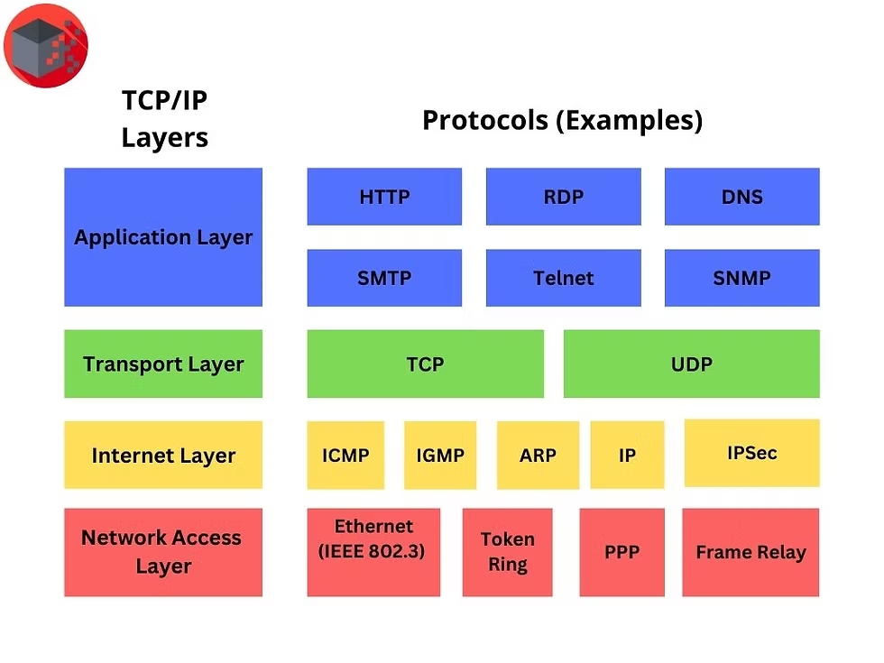

```
+---------------------------------------------------------------+
|                  APPLICATION LAYER                            |
|  Data: Email, Web, FTP, DNS, Streaming                        |
|                                                               |
|  (No header added at this layer by TCP/IP; handled by App)    |
+---------------------------------------------------------------+
|                  TRANSPORT LAYER                               |
|  TCP/UDP Header added:                                         |
|   - Source Port                                                |
|   - Destination Port                                           |
|   - Sequence Number / Acknowledgment Number (TCP only)        |
|   - Flags (TCP)                                               |
|   - Window Size / Checksum                                     |
|   - Length (UDP)                                              |
|  Purpose: Provides reliability (TCP) or speed (UDP)           |
+---------------------------------------------------------------+
|                  INTERNET LAYER                                 |
|  IP Header added:                                              |
|   - Version (IPv4/IPv6)                                       |
|   - Source IP / Destination IP                                 |
|   - TTL, Protocol                                              |
|   - Checksum                                                  |
|  Purpose: Logical addressing and routing                      |
+---------------------------------------------------------------+
|             NETWORK ACCESS / LINK LAYER                        |
|  Frame Header & Trailer added:                                 |
|   - Source MAC / Destination MAC                               |
|   - Frame Check Sequence (FCS)                                 |
|  Purpose: Physical delivery over local network                |
+---------------------------------------------------------------+
|                   PHYSICAL LAYER                                |
|  Bits transmitted over:                                        |
|   - Ethernet Cable, Fiber, Wi-Fi                                |
+---------------------------------------------------------------+

```
---

# **TCP/IP (Transmission Control Protocol / Internet Protocol)**

---

## **1. Definition**

**TCP/IP** is a **suite of communication protocols** used to interconnect network devices on the Internet. It defines how data should be **packaged, addressed, transmitted, routed, and received** across networks.

* **TCP** (Transmission Control Protocol): Ensures **reliable, ordered, and error-checked delivery of data** between applications.
* **IP** (Internet Protocol): Handles **logical addressing and routing** of packets from source to destination.

> **In simple terms:** TCP/IP is like a **postal system**: IP is the address on the envelope, TCP ensures the letter is delivered **without errors and in order**.

---

## **2. Philosophy of TCP/IP**

* **End-to-End Communication:** Intelligence is at the endpoints; the network simply forwards packets.
* **Interoperability:** Works across **different hardware and operating systems**.
* **Scalability:** Supports millions of devices across local and global networks.
* **Layered Approach:** Each layer has specific functions, simplifying **network design and troubleshooting**.

---

## **3. TCP/IP Layered Architecture**

TCP/IP has **four layers** (slightly different from OSI’s seven layers):

| Layer                     | Function                                                      | Example Protocols / Services |
| ------------------------- | ------------------------------------------------------------- | ---------------------------- |
| **Application**           | Provides network services to user applications                | HTTP, HTTPS, FTP, SMTP, DNS  |
| **Transport**             | Ensures reliable (TCP) or fast (UDP) delivery of data         | TCP, UDP                     |
| **Internet**              | Handles logical addressing and routing across networks        | IP (IPv4/IPv6), ICMP         |
| **Network Access / Link** | Handles physical transmission and local network communication | Ethernet, Wi-Fi, DSL, ARP    |

---

## **4. Key Features of TCP/IP**

1. **Reliable Communication (TCP)**:

   * Data is broken into segments, sent, and reassembled at the destination.
   * Error checking, acknowledgments, and retransmissions are used.

2. **Unreliable but Fast Delivery (UDP)**:

   * No guarantees for delivery, order, or error correction.
   * Used for **streaming, online gaming, and DNS queries**.

3. **Logical Addressing (IP)**:

   * Each device gets a **unique IP address** for routing.
   * IPv4 uses **32-bit addresses**, IPv6 uses **128-bit addresses**.

4. **Routing Across Networks**:

   * IP determines the best path for packets to reach their destination.

5. **Interoperable & Open Standard**:

   * Works across **heterogeneous networks** worldwide.

---

## **5. How TCP/IP Works**

1. **Data Creation:**

   * User sends an email or requests a web page.

2. **Segmentation & Encapsulation (Transport Layer):**

   * TCP breaks data into segments and adds a **TCP header** (source port, destination port, sequence number).
   * UDP simply adds a **UDP header** if used.

3. **Packet Creation (Internet Layer):**

   * IP adds **source and destination IP addresses** and forms a packet.

4. **Frame Transmission (Network Access Layer):**

   * Data is framed with MAC addresses for delivery within the local network.

5. **Physical Transmission:**

   * Data is converted into **bits** and transmitted over cables, fiber, or wireless media.

6. **Delivery & Reassembly:**

   * TCP reassembles segments in order and sends the data to the application.

---

## **6. TCP/IP Header Structure (Brief Overview)**

### **TCP Header Fields:**

* Source Port
* Destination Port
* Sequence Number
* Acknowledgment Number
* Flags (SYN, ACK, FIN, etc.)
* Window Size
* Checksum
* Urgent Pointer

### **IP Header Fields:**

* Version (IPv4 or IPv6)
* Header Length
* Total Length
* Identification
* TTL (Time to Live)
* Protocol (TCP, UDP, ICMP)
* Source IP
* Destination IP
* Header Checksum

> Each layer **adds its own header** to the data from the previous layer — this process is called **encapsulation**.

---

## **7. Importance of TCP/IP**

1. **Universal Standard:** Enables global connectivity.
2. **Reliable Communication:** TCP ensures error-free and ordered delivery.
3. **Routing Capability:** IP ensures data reaches the correct destination across networks.
4. **Supports Multiple Applications:** Web, email, file transfer, VoIP, streaming, etc.
5. **Scalable & Flexible:** Works in LANs, WANs, and the Internet.

---

## **8. Summary**

* **TCP/IP** is the **backbone protocol suite** of the Internet.
* TCP ensures **reliable delivery**, while IP handles **addressing and routing**.
* It is **layered, interoperable, scalable, and reliable**, making it suitable for all types of networks.
* Understanding TCP/IP is essential for **networking, cloud computing, and Internet services**.

---

If you want, I can also **draw a detailed TCP/IP stack diagram with headers and encapsulation flow**, which is **perfect for exams and notes**.

Do you want me to create that diagram?
