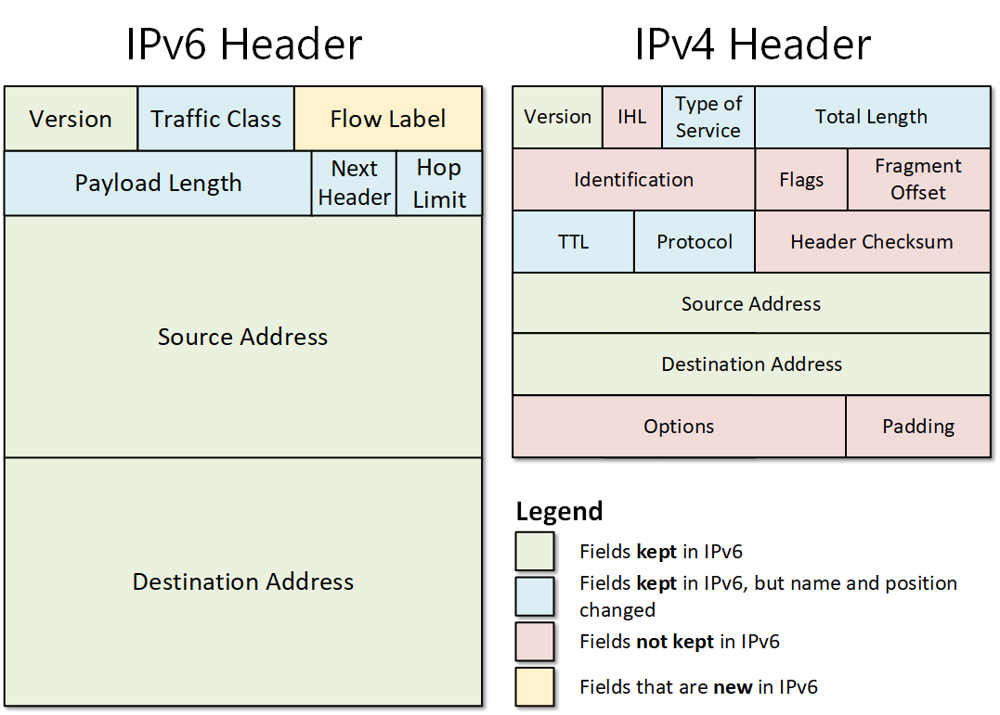

---

# **Internet Protocol Version 4 (IPv4)**

---

## **1. Definition**

**IPv4 (Internet Protocol version 4)** is the **fourth version of the Internet Protocol**, widely used to identify devices on a network and facilitate communication.

* It is a **connectionless, best-effort protocol** at the Network Layer (Layer 3) of the OSI model.
* Uses **32-bit logical addresses** to uniquely identify devices (hosts) on a network.
* Formatted in **dotted decimal notation**, divided into four 8-bit octets.

> **In simple terms:** IPv4 is like the “postal address system” of the Internet, ensuring each device has a unique address to send and receive data.

---

## **2. IPv4 Addressing**

### **2.1 Structure of IPv4 Address**

* 32 bits divided into **4 octets (8 bits each)**.
* Each octet is represented in **decimal (0–255)**.

**Example:**

```
192.168.1.1
```

* Binary: `11000000.10101000.00000001.00000001`

### **2.2 IPv4 Address Classes (Classful)**

Historically, IPv4 addresses were divided into classes:

| Class | Range                       | Default Subnet Mask | Purpose                           |
| ----- | --------------------------- | ------------------- | --------------------------------- |
| A     | 0.0.0.0 – 127.255.255.255   | 255.0.0.0 (/8)      | Large networks (16 million hosts) |
| B     | 128.0.0.0 – 191.255.255.255 | 255.255.0.0 (/16)   | Medium networks (65,534 hosts)    |
| C     | 192.0.0.0 – 223.255.255.255 | 255.255.255.0 (/24) | Small networks (254 hosts)        |
| D     | 224.0.0.0 – 239.255.255.255 | N/A                 | Multicast addresses               |
| E     | 240.0.0.0 – 255.255.255.255 | N/A                 | Experimental / future use         |

> Note: Modern networks use **classless addressing (CIDR)** instead of strict classes.

### **2.3 Special IPv4 Addresses**

| Type      | Example                                   | Use                            |
| --------- | ----------------------------------------- | ------------------------------ |
| Loopback  | 127.0.0.1                                 | Testing local device           |
| Private   | 10.0.0.0/8, 172.16.0.0/12, 192.168.0.0/16 | Internal networks              |
| Public    | 8.8.8.8                                   | Internet-routable addresses    |
| Broadcast | 255.255.255.255                           | Send to all hosts in a network |

---

## **3. IPv4 Packet Structure**

An IPv4 packet consists of **Header** and **Payload** (Data).

### **3.1 IPv4 Header Fields**

| Field                  | Size (bits) | Description                           |
| ---------------------- | ----------- | ------------------------------------- |
| Version                | 4           | IP version (4 for IPv4)               |
| IHL (Header Length)    | 4           | Header length in 32-bit words         |
| Type of Service (ToS)  | 8           | Priority & QoS for the packet         |
| Total Length           | 16          | Total packet length (header + data)   |
| Identification         | 16          | Unique ID for fragmentation           |
| Flags                  | 3           | Fragmentation control (DF, MF)        |
| Fragment Offset        | 13          | Position of fragment in original data |
| TTL (Time To Live)     | 8           | Max hops before packet is discarded   |
| Protocol               | 8           | Upper layer protocol (TCP=6, UDP=17)  |
| Header Checksum        | 16          | Error detection for header only       |
| Source IP Address      | 32          | Sender IP address                     |
| Destination IP Address | 32          | Receiver IP address                   |
| Options                | Variable    | Rarely used (security, routing)       |
| Data / Payload         | Variable    | Actual user data                      |

---

## **4. Key Features of IPv4**

1. **32-bit addressing** – Provides ~4.3 billion unique addresses.
2. **Connectionless** – Each packet is independent.
3. **Best-effort delivery** – No guarantee of order or delivery.
4. **Fragmentation support** – Packets can be divided to fit network MTU.
5. **Supports multiple protocols** – TCP, UDP, ICMP, etc.
6. **Routing capability** – Works with routers to forward packets across networks.

---

## **5. IPv4 Addressing Techniques**

1. **Unicast:** One-to-one communication.
2. **Broadcast:** One-to-all hosts in a network.
3. **Multicast:** One-to-many (specific group) communication.
4. **Private & Public:** Separation of internal and Internet-routable addresses.

---

## **6. Advantages of IPv4**

1. **Widely deployed** – Standard protocol for the Internet.
2. **Simple and efficient** – Easy to implement and manage.
3. **Supports subnetting** – Divides large networks into smaller subnets.
4. **Flexible** – Can work with various routing protocols.

---

## **7. Disadvantages of IPv4**

1. **Limited address space** – Only ~4.3 billion addresses; insufficient for growing Internet.
2. **No built-in security** – Lacks native encryption and authentication (IPv6 fixes this).
3. **Fragmentation overhead** – Large packets require processing and reassembly.
4. **Classful addressing limitations** – Wasted addresses in legacy systems (CIDR improved this).

---

## **8. Real-World Analogy**

* Think of **IPv4 address as a street address**:

  * **House number** = Host portion
  * **Street/City** = Network portion
  * **Letter** = Data packet
  * **Mail delivery system** = Routers and Internet paths

---

## **9. Summary**

* **IPv4** is the most widely used IP version with **32-bit addressing**.
* Provides **logical addressing, routing, and packet delivery** for the Internet.
* Features **connectionless, best-effort delivery** and **supports fragmentation, unicast, broadcast, and multicast**.
* Limitations include **address exhaustion, lack of security, and fragmentation overhead**, which are addressed in **IPv6**.

> **Exam Tip:** Draw an **IPv4 packet diagram** with header fields, show source/destination IP, TTL, protocol, and payload. Also, practice **subnetting and CIDR notation** questions.

---

I can also **create a detailed IPv4 packet diagram and subnetting example table** for exams if you want.

Do you want me to make that diagram and table?
