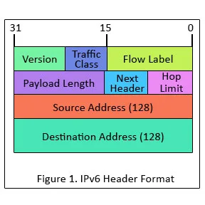

---

# **IPv6 (Internet Protocol Version 6)**

---

## **1. Definition**

**IPv6** is the latest version of the Internet Protocol, designed to replace IPv4. It provides **128-bit addresses**, enabling almost unlimited devices to connect to the Internet. IPv6 operates at the **Network Layer** and is **connectionless**, providing **best-effort delivery** of data.

---

## **2. Addressing in IPv6**

* IPv6 addresses are **128 bits long**, written as **8 groups of 16 bits in hexadecimal**, separated by colons (:).
  **Example:** `2001:0db8:85a3:0000:0000:8a2e:0370:7334`
* **Abbreviations:**

  1. Leading zeros in a group can be omitted.
  2. Consecutive zeros can be replaced by `::` (once per address).

**Types of IPv6 Addresses:**

| Type          | Purpose                              | Example     |
| ------------- | ------------------------------------ | ----------- |
| **Unicast**   | One-to-one communication             | 2001:db8::1 |
| **Multicast** | One-to-many communication            | ff00::1     |
| **Anycast**   | One-to-nearest-of-many communication | 2001:db8::2 |
| **Loopback**  | Test local device                    | ::1         |

> Note: IPv6 does not use **broadcast addresses**; multicast replaces them.

---

## **3. IPv6 Packet Structure**

* The **IPv6 packet** has a **fixed 40-byte header** and a payload.
* **Key fields of the header:**

  * Version (4 bits) – IPv6
  * Traffic Class (8 bits) – priority of packet
  * Flow Label (20 bits) – special flow for QoS
  * Payload Length (16 bits) – data size
  * Next Header (8 bits) – protocol type (TCP, UDP, ICMPv6)
  * Hop Limit (8 bits) – maximum hops (like TTL in IPv4)
  * Source Address (128 bits) – sender IP
  * Destination Address (128 bits) – receiver IP

> **Improvement:** No checksum field, reducing processing time.

---

## **4. Key Features of IPv6**

1. **128-bit addressing** – supports virtually unlimited devices.
2. **Auto-configuration** – devices can assign themselves addresses.
3. **Simpler header** – faster and more efficient routing.
4. **Built-in security** – IPsec is mandatory.
5. **No fragmentation by routers** – only source node fragments.
6. **Better support for QoS and mobility.**
7. **Supports unicast, multicast, and anycast** – no broadcast needed.

---

## **5. Advantages of IPv6**

1. Large address space solves IPv4 exhaustion.
2. Improved routing and packet processing.
3. Simplified network configuration with auto-configuration.
4. Enhanced security with mandatory IPsec.
5. Supports modern Internet needs like IoT and mobile networks.

---

## **6. Disadvantages of IPv6**

1. Not backward compatible with IPv4.
2. Larger addresses are harder to remember.
3. Hardware and software may need upgrades.
4. Initial learning curve for network administrators.

---

## **7. IPv4 vs IPv6 (Quick Comparison)**

| Feature        | IPv4                 | IPv6                                    |
| -------------- | -------------------- | --------------------------------------- |
| Address Length | 32 bits              | 128 bits                                |
| Address Space  | ~4.3 billion         | Virtually unlimited                     |
| Header Size    | 20–60 bytes          | 40 bytes (fixed)                        |
| Configuration  | Manual / DHCP        | Stateless / Stateful auto-configuration |
| Security       | Optional             | Mandatory (IPsec)                       |
| Fragmentation  | Routers can fragment | Only source fragments                   |
| Broadcast      | Yes                  | No (multicast used)                     |

---

## **8. Summary**

* IPv6 is the **next-generation Internet Protocol**, solving IPv4 limitations.
* Its **128-bit addressing**, **auto-configuration**, **built-in security**, and **simplified header** make it ideal for modern networks.
* IPv6 is essential for **future Internet growth**, including mobile devices, IoT, and global connectivity.

---

This version is **structured**, **simple**, and ready to write in a **university exam**.

If you like, I can also **make a one-page “super-short version” for last-minute revision** that covers all key points.

Do you want me to make that?
