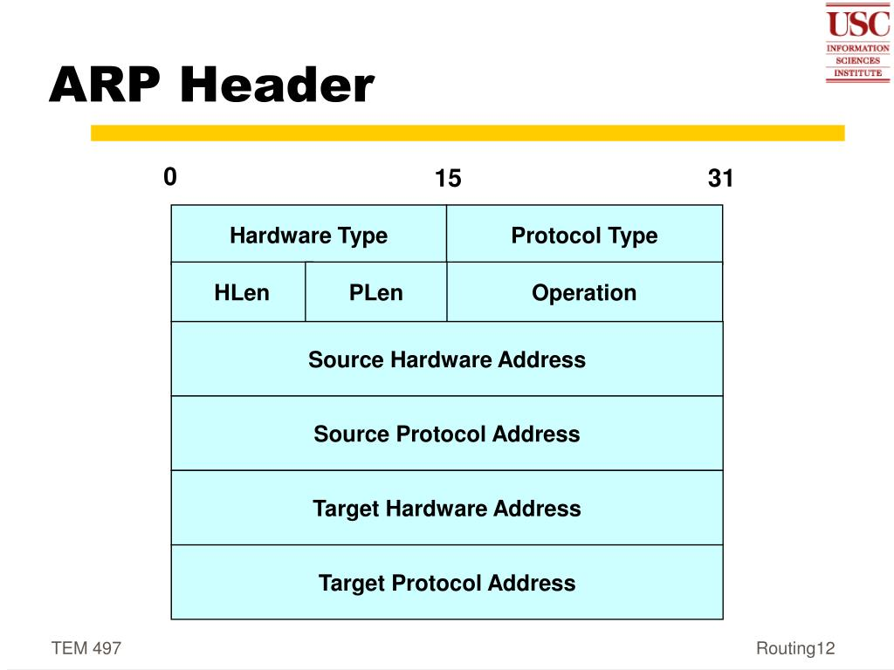

---

# **Address Resolution Protocol (ARP)**

---

## **1. Definition**

**ARP (Address Resolution Protocol)** is a protocol used in **TCP/IP networks** to map a **known IP address** (logical address) to a **MAC address** (physical or hardware address) of a device on the same local network (LAN).

* It operates at the **Network Layer (IP)** but interacts with the **Data Link Layer (Ethernet)**.
* ARP is essential for **IPv4 networks** because communication on Ethernet requires MAC addresses, not IP addresses.

> **In simple terms:** ARP is like asking, *“I know the house number (IP), but what is the street address (MAC)?”*

---

## **2. Types of ARP**

1. **ARP Request**

   * Sent by a device to **find the MAC address** of a device with a known IP.
   * Broadcast to all devices on the LAN.

2. **ARP Reply**

   * Sent by the device that owns the IP address.
   * Unicast back to the requester with its MAC address.

3. **Gratuitous ARP**

   * Sent by a device to **announce its IP-MAC mapping** without any request.
   * Used for **IP conflict detection** or updating ARP caches.

---

## **3. How ARP Works**

**Step 1: Device wants to communicate**

* A device knows the **destination IP** but does not know its MAC address.

**Step 2: ARP Request**

* The device sends a **broadcast ARP request**: “Who has IP X.X.X.X? Tell me your MAC.”

**Step 3: ARP Reply**

* The device with the matching IP responds with its **MAC address** via **unicast**.

**Step 4: ARP Cache Update**

* The requesting device stores the mapping in its **ARP cache** for future use, reducing repeated broadcasts.

---

## **4. ARP Packet/Header Format**

The ARP header consists of the following fields:

| Field                              | Size    | Description                                    |
| ---------------------------------- | ------- | ---------------------------------------------- |
| **Hardware Type (HTYPE)**          | 16 bits | Type of hardware (Ethernet = 1)                |
| **Protocol Type (PTYPE)**          | 16 bits | Type of protocol (IPv4 = 0x0800)               |
| **Hardware Address Length (HLEN)** | 8 bits  | Length of MAC address (6 bytes for Ethernet)   |
| **Protocol Address Length (PLEN)** | 8 bits  | Length of IP address (4 bytes for IPv4)        |
| **Operation**                      | 16 bits | Type of ARP message (1 = Request, 2 = Reply)   |
| **Sender MAC Address**             | HLEN    | MAC address of the sender                      |
| **Sender IP Address**              | PLEN    | IP address of the sender                       |
| **Target MAC Address**             | HLEN    | MAC address of the target (unknown in request) |
| **Target IP Address**              | PLEN    | IP address of the target                       |

---

### **5. ARP Packet Diagram**

```
+----------------+----------------+------------+------------+
| Hardware Type  | Protocol Type  | HLEN (8b)  | PLEN (8b)  |
+----------------+----------------+------------+------------+
| Operation (16b)                                           |
+-----------------------------------------------------------+
| Sender MAC Address (48b)                                  |
+-----------------------------------------------------------+
| Sender IP Address (32b)                                   |
+-----------------------------------------------------------+
| Target MAC Address (48b)                                  |
+-----------------------------------------------------------+
| Target IP Address (32b)                                   |
+-----------------------------------------------------------+
```

> **Explanation of Diagram:**

* The **first fields** define the type of network and protocol used.
* **Operation** indicates whether it is a request or a reply.
* **Sender fields** contain the sender’s IP and MAC.
* **Target fields** contain the target’s IP and MAC. In ARP requests, the target MAC is unknown (set to 00:00:00:00:00:00).

---

## **6. Features of ARP**

1. Maps **IP addresses to MAC addresses** on local networks.
2. Works only on **local broadcast domains**.
3. Uses **ARP cache** to reduce repeated requests.
4. Supports **dynamic resolution** without manual configuration.

---

## **7. Limitations of ARP**

1. **Security issues:** ARP is vulnerable to **ARP spoofing or poisoning attacks**.
2. **Local network only:** Cannot resolve MAC addresses across routers.
3. **Broadcast traffic:** Excessive ARP requests can increase network load.

---

## **8. Summary**

* ARP is essential in IPv4 networks for **mapping IP to MAC addresses**.
* It uses **ARP request/reply messages** to discover physical addresses.
* Each ARP packet contains **sender and target IP/MAC addresses**, along with type and operation fields.
* ARP is **fast, automatic, and critical** for communication in LANs but has **security and scalability limitations**.

---

If you want, I can also **draw a simple visual diagram showing ARP request and reply flow**, which is perfect for **university exams**.

Do you want me to make that diagram?
