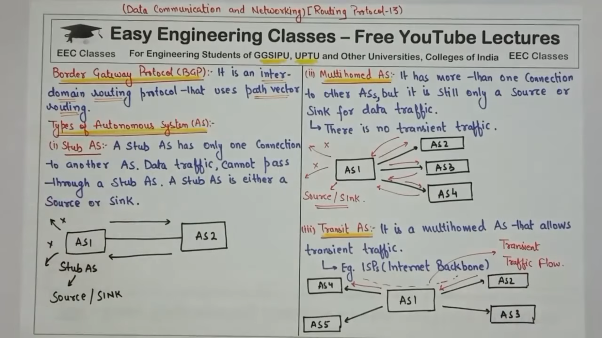
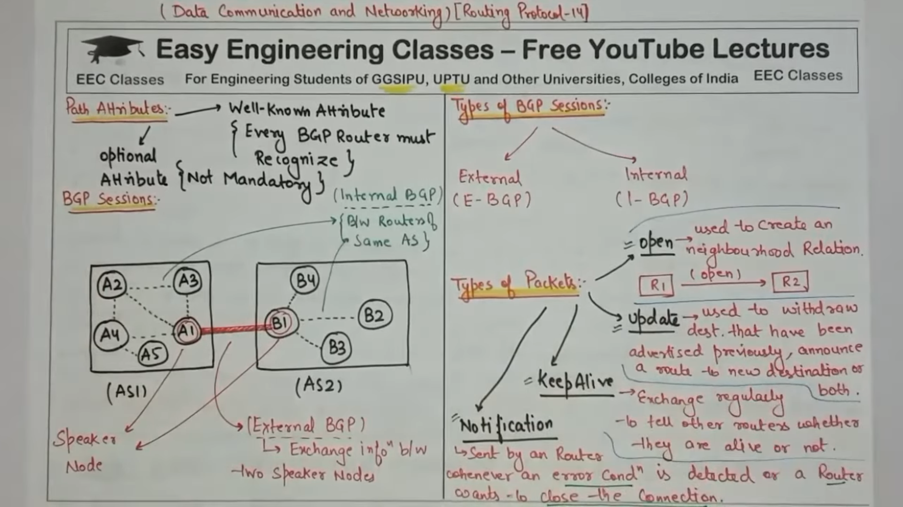
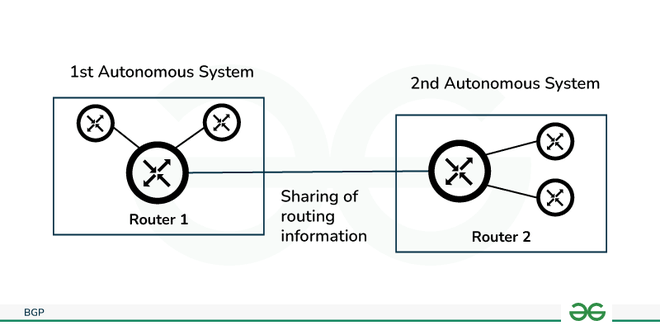

---

# **Border Gateway Protocol (BGP)**

---

### **1. Definition**

**BGP (Border Gateway Protocol)** is a **path-vector routing protocol** used to exchange routing information **between Autonomous Systems (ASes)** on the Internet.

* It is classified as an **Exterior Gateway Protocol (EGP)**.
* BGP ensures **loop-free routing** between large networks.
* It is the **protocol that makes the Internet work**, connecting different ISPs and large organizations.

> **In simple words:** BGP is like the “postal service” of the Internet — it decides the **best route** to send data across multiple networks (Autonomous Systems).

---

### **2. Key Features**

1. **Path-Vector Protocol**

   * Each route contains a **path of AS numbers** it passes through (AS_PATH).
   * Helps **prevent routing loops**.

2. **Inter-AS Routing**

   * BGP is designed to work **between Autonomous Systems** (different organizations, ISPs).

3. **Policy-Based Routing**

   * Network administrators can control **which routes to accept, prefer, or advertise** using policies.

4. **TCP-Based**

   * BGP uses **TCP port 179** for reliable communication between routers.

5. **Loop Prevention**

   * Routes contain **AS_PATH**, so routers **ignore routes that already include their AS**.

6. **Scalable**

   * Handles **large numbers of routes**, making it suitable for Internet-wide routing.

---

### **3. Types of BGP**

**BGP has two main types:**

| Type             | Abbreviation | Use Case                                                          |
| ---------------- | ------------ | ----------------------------------------------------------------- |
| **External BGP** | eBGP         | Connects routers between **different Autonomous Systems (ASes)**. |
| **Internal BGP** | iBGP         | Connects routers **within the same Autonomous System (AS)**.      |

> **Tip:** eBGP = between AS, iBGP = within AS.

---

### **4. How BGP Works (Step by Step)**

#### **Step 1: Neighbor Establishment**

* Routers form a **BGP session** with peers (neighbors).
* Uses **TCP port 179** to establish a reliable connection.

#### **Step 2: Exchange Routes**

* Routers send their **full routing table** to neighbors.
* Each route contains **destination prefixes** and **AS_PATH** information.

#### **Step 3: Best Path Selection**

BGP selects the **best route** using these rules (simplified order):

1. **Highest weight** (Cisco-specific)
2. **Highest local preference**
3. **Shortest AS_PATH**
4. **Lowest origin type** (IGP < EGP < Incomplete)
5. **Lowest MED (Multi-Exit Discriminator)**
6. **eBGP over iBGP**
7. **Lowest IGP cost to next hop**

> This ensures that traffic takes the most **efficient and policy-compliant path**.

#### **Step 4: Routing Table Update**

* Best routes are installed in the **BGP routing table** and advertised to neighbors.
* Routes that are not selected as “best” are kept as **backup paths**.

---

### **5. Important BGP Terminology**

| Term                               | Explanation                                                          |
| ---------------------------------- | -------------------------------------------------------------------- |
| **AS (Autonomous System)**         | A network or group of networks under a single administrative domain. |
| **AS_PATH**                        | List of ASes a route passes through; prevents loops.                 |
| **NEXT_HOP**                       | IP address of the next router to reach the destination.              |
| **MED (Multi-Exit Discriminator)** | Suggests preferred entry point into an AS.                           |
| **Local Preference**               | Priority of outgoing routes; higher is preferred.                    |
| **BGP Peer/Neighbor**              | Another BGP router with which routes are exchanged.                  |
| **Route Reflector**                | Reduces iBGP full-mesh requirement in large ASes.                    |

---

### **6. Advantages of BGP**

1. **Scalable for the Internet** – Can handle **millions of routes**.
2. **Loop-Free Inter-AS Routing** – AS_PATH prevents routing loops.
3. **Policy-Based Control** – Administrators can filter or prefer routes.
4. **Supports Redundancy** – Multiple paths can exist; failover is automatic.
5. **Highly Reliable** – Built on TCP for guaranteed delivery of updates.

---

### **7. Disadvantages of BGP**

1. **Complex Configuration** – Requires careful planning for policies and filters.
2. **Slow Convergence** – Changes propagate slowly compared to IGPs like OSPF.
3. **High Resource Usage** – Needs more CPU and memory in large networks.
4. **No Automatic Metric Optimization** – Routes are chosen mainly by policy, not by shortest path in terms of speed or latency.

---

### **8. BGP Example (Simple)**

Suppose **AS100** wants to reach a network in **AS200**:

* AS100 → Router R1 → eBGP → R2 in AS200 → Destination Network 10.20.30.0/24
* Route advertised by R2:

```
Network: 10.20.30.0/24
AS_PATH: 200
NEXT_HOP: 192.168.100.2
```

* R1 in AS100 receives this route, notes the AS_PATH, and can decide whether to use it based on policy.
* If another path exists through AS300, BGP will compare **AS_PATH lengths** and **local preferences** to select the best route.

---

### **9. BGP vs OSPF (Quick Comparison)**

| Feature               | BGP                             | OSPF                               |
| --------------------- | ------------------------------- | ---------------------------------- |
| **Type**              | Exterior Gateway Protocol (EGP) | Interior Gateway Protocol (IGP)    |
| **Scope**             | Between ASes                    | Within a single AS                 |
| **Routing Algorithm** | Path-Vector                     | Link-State (Shortest Path First)   |
| **Convergence**       | Slower                          | Faster                             |
| **Scalability**       | Very high                       | Medium                             |
| **Policy Control**    | Strong (via route policies)     | Limited                            |
| **Use Case**          | Internet-wide routing           | Enterprise or ISP internal routing |

---

### **10. Summary (Exam-Friendly)**

* **BGP** is the **Internet’s backbone protocol** connecting different Autonomous Systems.
* Uses **path-vector method**, **AS_PATH**, and **policy-based routing**.
* Supports **eBGP (between AS)** and **iBGP (within AS)**.
* Best path selection considers **local preference, AS_PATH, MED, and policies**.
* Advantages: scalable, loop-free, policy-controlled.
* Disadvantages: complex, slow convergence, resource-intensive.


---
**Border Gateway Protocol (BGP)** is the specialized routing protocol that manages how data is exchanged across the internet. While OSPF and RIP manage routing *inside* a single organization, BGP manages routing *between* different organizations, such as Internet Service Providers (ISPs), universities, and tech giants.

Because it connects different administrative entities, BGP is often called the **"Post Office of the Internet."**

---

## 1. Core Concept: Autonomous Systems (AS)
To understand BGP, you must first understand the **Autonomous System (AS)**. An Autonomous System is a large network or a group of networks under the control of a single entity (like Google, Comcast, or your University).
*   Every Autonomous System is assigned a unique **Autonomous System Number (ASN)**.
*   BGP is the language these Autonomous Systems use to tell each other which IP addresses they "own" and which paths are available to reach them.

---

## 2. Types of BGP
BGP operates in two different modes depending on where the neighbors are located:

### External BGP (eBGP)
This is used to connect two different Autonomous Systems. For example, it is used to connect an ISP like Airtel to an ISP like Verizon. It is the core mechanism of the global internet.

### Internal BGP (iBGP)
This is used within a single Autonomous System to synchronize routing information between all the internal BGP routers. It ensures that the "exit points" of the network all agree on the best path to an external destination.


---

## 3. How BGP Works: Path-Vector Routing
Unlike OSPF, which calculates the shortest path based on speed (Bandwidth), BGP is a **Path-Vector Protocol**. It looks at the list of Autonomous Systems a packet must jump through to reach its destination.

### The Routing Decision Process
BGP does not automatically choose the fastest path. Instead, it uses **Attributes** to decide the best route. The most common attributes are:
1.  **AS-PATH:** The list of Autonomous System numbers the packet will cross. BGP generally prefers the path with the fewest AS hops.
2.  **Next Hop:** The IP address of the next router to send data to.
3.  **Local Preference:** A value used to tell internal routers which exit path is preferred for outgoing traffic.
4.  **MED (Multi-Exit Discriminator):** A value used to tell external neighbors which entry point into your network is preferred.

---

## 4. Key Features of BGP

*   **Reliability:** BGP uses **TCP (Transmission Control Protocol) on Port 179** to communicate. This ensures that routing updates are delivered reliably and aren't lost.
*   **Incremental Updates:** After the initial exchange of the full routing table, BGP only sends updates when a change occurs (e.g., a new network is added or a path goes down). This saves massive amounts of bandwidth.
*   **Policy-Based Routing:** This is the most important feature. BGP allows administrators to set rules based on business agreements rather than technical speed. (Example: "Don't send traffic through ISP-X because they charge too much.")
*   **Scalability:** BGP is designed to handle the massive global routing table, which currently contains over 900,000 individual routes.

---

## 5. BGP Message Types
BGP routers communicate using four specific message types:
1.  **Open:** Used to establish a session with a neighbor and agree on parameters (like the ASN).
2.  **Keepalive:** Sent periodically to confirm that the neighbor is still active.
3.  **Update:** Used to announce new routes or withdraw old, unreachable routes.
4.  **Notification:** Sent when an error is detected, usually followed by closing the connection.

---

## 6. Summary Comparison: OSPF vs. BGP

| Feature | OSPF | BGP |
| :--- | :--- | :--- |
| **Type** | Interior Gateway Protocol (IGP) | Exterior Gateway Protocol (EGP) |
| **Algorithm** | Link-State (Dijkstra) | Path-Vector |
| **Speed** | Very Fast (Seconds) | Slower (Minutes) |
| **Metric** | Cost (Bandwidth) | Attributes (AS-Path, Policies) |
| **Usage** | Inside a single network/company | Between ISPs / The Internet |


---

## 7. Simple Real-World Analogy
Imagine you want to send a letter from **India** to a friend in **New York**.
*   **OSPF** is like the **Local Post Office** in your city. It knows every street and the fastest way to get your letter to the city's main sorting center.
*   **BGP** is like the **International Shipping System**. It doesn't care about the streets in New York; it only cares about which airline or shipping company will take the letter from India to the USA. It looks at the "Path" (India -> UK -> USA) and decides the best route based on cost and agreements.
