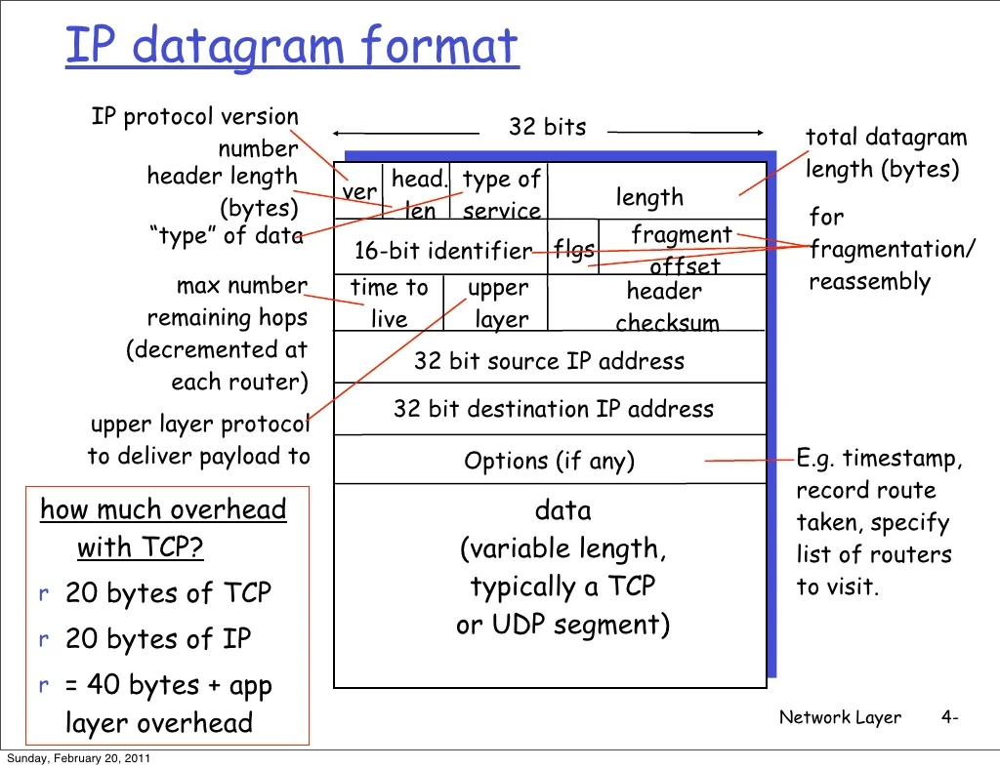

Absolutely! Let’s create a **detailed, structured, and exam-ready explanation** of **IP Datagram**, covering its definition, structure, fields, working, types, advantages, disadvantages, and examples.

---

# **IP Datagram**

---

## **1. Definition**

An **IP Datagram** is a **basic unit of data transfer at the Network Layer (Layer 3) in the OSI model**. It is used by the **Internet Protocol (IP)** to send data from a **source device to a destination device** across an IP network.

* Think of an IP datagram as a **digital envelope** that carries both **address information** (like sender and receiver IPs) and the **actual data payload**.
* It is **connectionless** and **may take different paths** to reach the destination.

> **In simple terms:** An IP datagram is like a **letter with a sender address, receiver address, and the message inside** that can travel across the network independently.

---

## **2. Structure of an IP Datagram**

An IP datagram has **two main parts**:

1. **Header** – Contains control and addressing information.
2. **Data / Payload** – The actual data being transmitted (e.g., part of a TCP segment, UDP datagram, or ICMP message).

---

### **2.1 IP Datagram Header Fields**

| Field                  | Size (bits) | Description                                                            |
| ---------------------- | ----------- | ---------------------------------------------------------------------- |
| Version                | 4           | IP version (IPv4 = 4, IPv6 = 6)                                        |
| Header Length (IHL)    | 4           | Length of header in 32-bit words                                       |
| Type of Service (ToS)  | 8           | Quality of service, priority for delivery                              |
| Total Length           | 16          | Total length of datagram (header + data) in bytes                      |
| Identification         | 16          | Unique ID for fragmentation/reassembly                                 |
| Flags                  | 3           | Control fragmentation (e.g., DF = Don't Fragment, MF = More Fragments) |
| Fragment Offset        | 13          | Position of this fragment in the original data                         |
| Time To Live (TTL)     | 8           | Maximum hops before packet is discarded to prevent infinite loops      |
| Protocol               | 8           | Indicates upper layer protocol (TCP=6, UDP=17, ICMP=1)                 |
| Header Checksum        | 16          | Error detection for the header only                                    |
| Source IP Address      | 32          | IP address of sender                                                   |
| Destination IP Address | 32          | IP address of receiver                                                 |
| Options                | Variable    | Optional; rarely used (security, routing)                              |
| Data / Payload         | Variable    | Actual user data being transported                                     |

---

## **3. How an IP Datagram Works**

### **Step 1: Creation**

* The transport layer (TCP/UDP) hands data to the **network layer**.
* Network layer encapsulates it into an **IP datagram**, adds the header, sets source and destination IP addresses.

### **Step 2: Fragmentation (if needed)**

* If the datagram is **larger than the Maximum Transmission Unit (MTU)** of a network, it is **fragmented** into smaller datagrams.
* Each fragment has its **own header** but shares the same **Identification field**.

### **Step 3: Routing**

* Routers forward datagrams toward the **destination IP** using **routing tables**.
* Each router **decrements the TTL** to prevent loops.
* Datagram may **take different paths** to the destination (connectionless).

### **Step 4: Reassembly**

* At the destination, fragments are **reassembled** using the **Identification, Fragment Offset, and MF flag**.
* After reassembly, the data is passed to the **transport layer** for processing.

---

## **4. Features of IP Datagram**

1. **Connectionless:** Each datagram is treated independently.
2. **Unreliable delivery:** No guarantee of delivery, order, or error recovery (handled by TCP/UDP).
3. **Fragmentation support:** Can be split to fit smaller networks.
4. **Flexible:** Can carry data from various upper-layer protocols.
5. **Supports addressing:** Source and destination IP addresses ensure correct delivery.

---

## **5. Advantages**

1. **Simple and efficient** – No connection setup needed.
2. **Supports heterogeneous networks** – Can travel across different network types.
3. **Flexible and scalable** – Can handle various data sizes and protocols.
4. **Fragmentation support** – Ensures delivery even on networks with smaller MTU.

---

## **6. Disadvantages**

1. **Unreliable delivery** – IP does not guarantee that the datagram will reach the destination.
2. **No error correction** – Only header checksum; payload errors are handled by upper layers.
3. **Out-of-order delivery possible** – Each datagram may take a different route.
4. **Fragmentation overhead** – Large datagrams may require multiple fragments, increasing processing.

---

## **7. Types of IP Datagram**

| Type                   | Description                                                       |
| ---------------------- | ----------------------------------------------------------------- |
| **Unicast Datagram**   | Sent from one sender to one receiver.                             |
| **Broadcast Datagram** | Sent from one sender to all devices in a network.                 |
| **Multicast Datagram** | Sent from one sender to a specific group of receivers.            |
| **Anycast Datagram**   | Sent to the **nearest** device among a group of receivers (IPv6). |

---

## **8. Real-World Analogy**

* Imagine sending a **letter through postal service**:

  * **Envelope header** = IP header (addresses, instructions)
  * **Letter inside** = Data/payload
  * **Post offices along the way** = Routers forwarding the datagram
  * **Broken or lost letters** = Unreliable, no guarantee unless sender uses registered mail (TCP layer handles reliability)

---

## **9. Summary**

* **IP Datagram:** Basic unit of data at the network layer, carrying both **header information** and **user data**.
* **Key characteristics:** Connectionless, flexible, supports fragmentation, uses source and destination IP addresses.
* **Strengths:** Simple, efficient, works over heterogeneous networks.
* **Weaknesses:** Unreliable, may arrive out of order, no error correction for data.

> **Exam Tip:** Draw an IP datagram with **all header fields labeled** and a small **payload example**. It’s a common diagram question.

---

I can also **draw a neat, labeled IP datagram diagram showing all fields and payload**, perfect for exams.

Do you want me to create that diagram?
