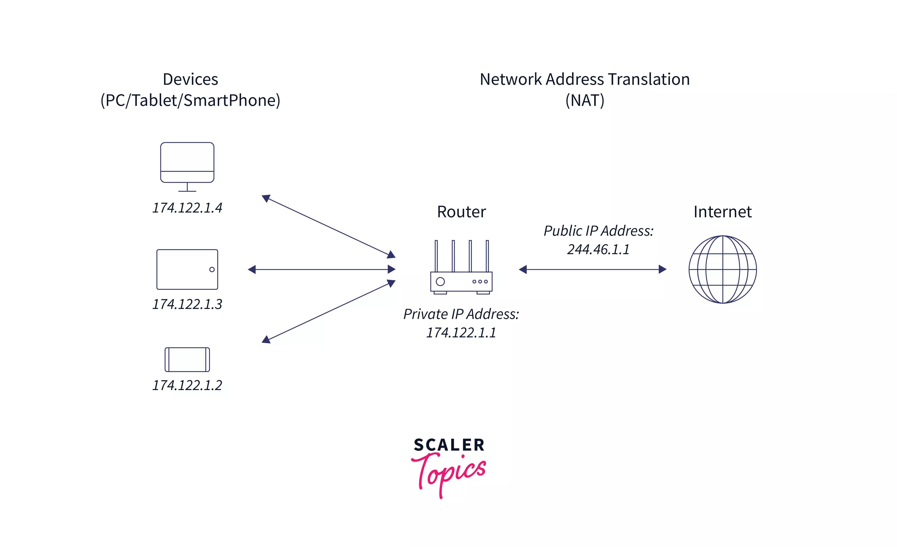

---

# **Network Address Translation (NAT)**

---

## **1. Definition**

**Network Address Translation (NAT)** is a technique used in networking that **modifies the IP address information in IP packet headers** while they pass through a router or firewall.

* It allows **multiple devices in a private network** to share a single **public IP address** for Internet access.
* NAT is widely used in **IPv4 networks** to overcome the shortage of public IP addresses.

> **In simple terms:** NAT is like a **translator** between your private home network and the Internet. Your devices have private addresses internally, but NAT maps them to a public address when accessing the Internet.

---

## **2. Key Features of NAT**

1. **IP Address Conservation**

   * Enables multiple devices to share a single public IP.

2. **Security**

   * Hides internal network structure from the external world.
   * Makes it difficult for attackers to directly access internal devices.

3. **Flexibility**

   * Supports dynamic and static mapping between private and public IPs.

4. **Transparency**

   * Works without requiring any changes on client devices.

---

## **3. How NAT Works**

### **Step 1: Packet Departure (Internal to External)**

1. A device in the private network sends a packet to the Internet.
2. NAT router **replaces the source IP address** (private IP) with a public IP address.
3. The router keeps a **translation table** to track which internal device is associated with each public IP/port.

### **Step 2: Packet Return (External to Internal)**

1. The external server responds to the public IP address.
2. NAT router **looks up the translation table** to determine the correct internal device.
3. The router **replaces the destination IP** with the private IP and forwards the packet.

> **Example:**
> | Private IP | Source Port | Public IP | NAT Table Entry |
> |------------|------------|-----------|----------------|
> | 192.168.1.2 | 5000       | 203.0.113.5 | 192.168.1.2:5000 → 203.0.113.5:40000 |

---

## **4. Types of NAT**

| Type                                              | Description                                                                   | Example Use Case                                              |
| ------------------------------------------------- | ----------------------------------------------------------------------------- | ------------------------------------------------------------- |
| **Static NAT**                                    | Maps a single private IP to a single public IP.                               | Hosting a server accessible from the Internet.                |
| **Dynamic NAT**                                   | Maps private IPs to a pool of public IPs on a first-come, first-served basis. | Medium-sized office with multiple devices accessing Internet. |
| **PAT (Port Address Translation) / NAT Overload** | Maps multiple private IPs to a single public IP using **different ports**.    | Home network sharing one ISP IP address.                      |
| **NAT64**                                         | Translates IPv6 addresses to IPv4 addresses.                                  | Transitioning from IPv6-only networks to IPv4 Internet.       |

> **Exam Tip:** Remember **Static = 1:1**, **Dynamic = 1:Many**, **PAT = Many:1 with ports**.

---

## **5. Advantages of NAT**

1. **IP Address Conservation** – Reduces the number of public IPs required.
2. **Security & Privacy** – Internal IPs are hidden from the external Internet.
3. **Network Flexibility** – Allows renumbering internal networks without changing public IPs.
4. **Simplifies Administration** – Easy to implement for small and large networks.

---

## **6. Disadvantages of NAT**

1. **Breaks End-to-End Connectivity** – Can interfere with protocols requiring direct IP visibility (e.g., VoIP, FTP).
2. **Performance Overhead** – Router needs to maintain translation tables, which can affect throughput.
3. **Complex Troubleshooting** – Harder to trace packets due to IP translation.
4. **Protocol Compatibility Issues** – Some applications may need **NAT traversal** techniques.

---

## **7. NAT vs No NAT (Quick Comparison)**

| Feature               | NAT                              | No NAT                        |
| --------------------- | -------------------------------- | ----------------------------- |
| **IP Conservation**   | Saves public IPs                 | Each device needs a public IP |
| **Security**          | Hides internal network           | Exposed to Internet           |
| **Complexity**        | Medium (needs translation table) | Simple                        |
| **End-to-End Access** | Limited                          | Fully accessible              |
| **Scalability**       | Good for large networks          | Requires many public IPs      |

---

## **8. Real-World Analogy**

* Imagine your **home network** as a neighborhood with private house numbers (private IPs).
* The **post office (NAT router)** uses a single official address (public IP) for sending mail outside the city.
* Each outgoing letter gets a **unique identifier (port number)** so the post office knows which house to deliver the reply to.

> This is exactly how PAT works for most home networks.

---

## **9. Summary**

* **NAT** is a technique to **translate private IP addresses to public IP addresses** and vice versa.
* **Key benefits:** IP conservation, security, and flexibility.
* **Key types:** Static, Dynamic, PAT, NAT64.
* **Limitations:** Breaks end-to-end connectivity, adds overhead, and may require traversal solutions for some protocols.
* **Exam Tip:** Always remember the **PAT = Many:1 mapping using ports**, and draw a **small diagram showing private → public mapping with ports** for full marks.

---

If you want, I can also make a **clear diagram showing NAT, Dynamic NAT, and PAT working together**, perfect for **quick exam revision**.

Do you want me to create that diagram?
