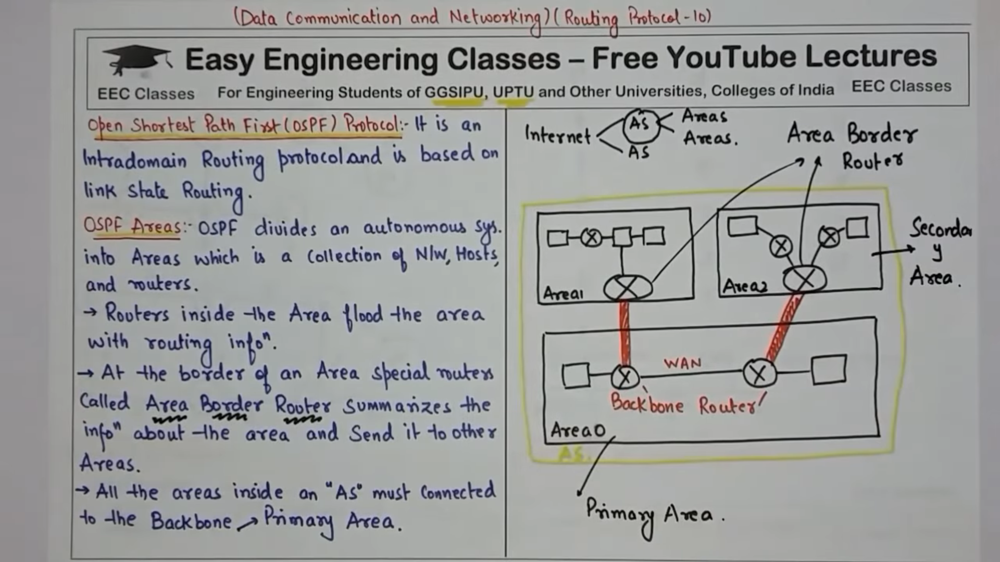
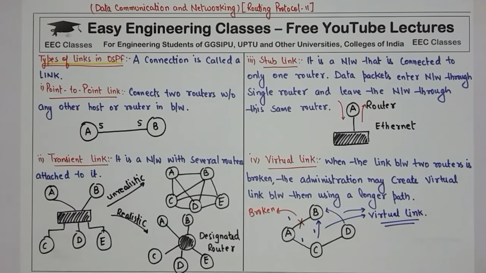
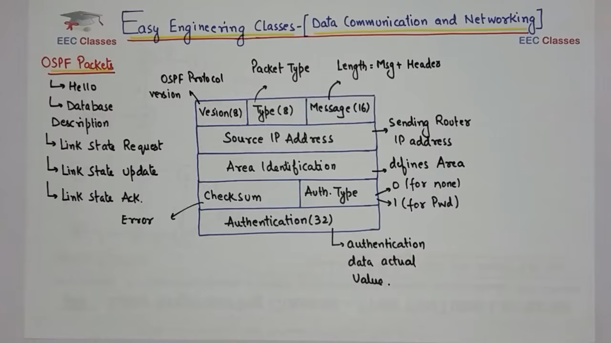

To provide a high-quality, exam-ready explanation, here is the refined, structured, and comprehensive guide to **Open Shortest Path First (OSPF)**. This version uses full terminology and is organized for maximum clarity.

---

# Open Shortest Path First (OSPF) Protocol

## 1. Definition and Core Concept
**Open Shortest Path First (OSPF)** is a **Link-State Interior Gateway Protocol (IGP)**. It is used to distribute routing information within a single **Autonomous System (AS)**. 

Unlike older protocols that only know the "distance" to a destination, OSPF allows every router to see a complete map of the entire network. It uses **Dijkstra’s Shortest Path First (SPF) Algorithm** to calculate the most efficient path for data to travel.

---

## 2. Key Features
*   **No Routing Loops:** Because every router knows the full network layout, it is mathematically impossible for a loop to occur.
*   **Fast Convergence:** OSPF reacts almost instantly to network changes (like a broken cable) and updates all routers immediately.
*   **Hierarchical Structure:** It uses **Areas** to break large networks into smaller, manageable sections, which saves memory and processing power.
*   **Classless Inter-Domain Routing (CIDR):** It supports modern IP addressing and **Variable Length Subnet Masking (VLSM)**.
*   **Secure Communication:** It supports **Authentication**, ensuring that only trusted routers can exchange network information.

---

## 3. Important Terminology
To understand OSPF, you must know these five key terms:

1.  **Link-State Advertisement (LSA):** A small data packet that describes the "state" of a router's connection (e.g., "Interface 1 is Up and has a speed of 100Mbps").
2.  **Link-State Database (LSDB):** The "Map." It is a collection of all LSAs received from every router in the area. Every router in an area must have an identical LSDB.
3.  **Area:** A logical grouping of routers. **Area 0** is the **Backbone Area**, and all other areas must connect to it.
4.  **Router Identity (Router ID):** A unique name (formatted like an IP address) used to identify each router in the OSPF network.
5.  **Designated Router (DR):** In a large group of routers, one is elected as the "leader" (the Designated Router) to manage the exchange of information and reduce network traffic.

---

## 4. How OSPF Works (The 5-Step Process)

### Step 1: Discovering Neighbors
Routers send out **Hello Packets** to find other OSPF routers. Once they find a neighbor and agree on basic rules, they become "Neighbors."

### Step 2: Exchanging Information
Routers share their **Link-State Advertisements (LSAs)**. This is like neighbors sharing pieces of a puzzle. Eventually, everyone has all the pieces.

### Step 3: Building the Map
Every router puts the puzzle pieces together to form the **Link-State Database (LSDB)**. This is a complete map of every router and every connection in the network.

### Step 4: Finding the Best Path
Each router runs the **Shortest Path First (SPF) Algorithm**. It looks at the map and calculates the mathematically "cheapest" (fastest) way to get to every other part of the network.

### Step 5: Updating the Routing Table
The best paths found in Step 4 are saved into the **Routing Table**. When a user sends data, the router looks at this table to send the packet on its way instantly.

---

## 5. The OSPF Metric: "Cost"
OSPF uses a value called **Cost** to decide which path is better. A lower cost is always better. Cost is calculated based on the bandwidth (speed) of the link:

$$ \text{Cost} = \frac{\text{Reference Bandwidth (usually 100,000,000)}}{\text{Interface Bandwidth in bits per second}} $$

*   **Fast Ethernet (100 Mbps):** Cost = 1
*   **Ethernet (10 Mbps):** Cost = 10
*   **T1 Line (1.5 Mbps):** Cost = 64

**Example:** If Path A has a total cost of **5** and Path B has a total cost of **12**, OSPF will always send data through **Path A**.

---

## 6. Summary: Advantages and Disadvantages

| Advantages | Disadvantages |
| :--- | :--- |
| **Very Fast:** Detects changes in seconds. | **Complex:** Harder to set up than simple protocols. |
| **Efficient:** Only sends updates when things change. | **Heavy:** Requires more RAM and CPU power. |
| **Scalable:** Can handle very large networks easily. | **Strict:** Requires a central "Backbone" (Area 0). |

---

## 7. Exam Tip: The "Tree" Concept
In an exam, remember that OSPF turns the network into a **Tree**. The router you are on is the **Root**, and all other networks are the **Branches**. The **Shortest Path First** algorithm simply finds the shortest distance from the Root to every Branch.