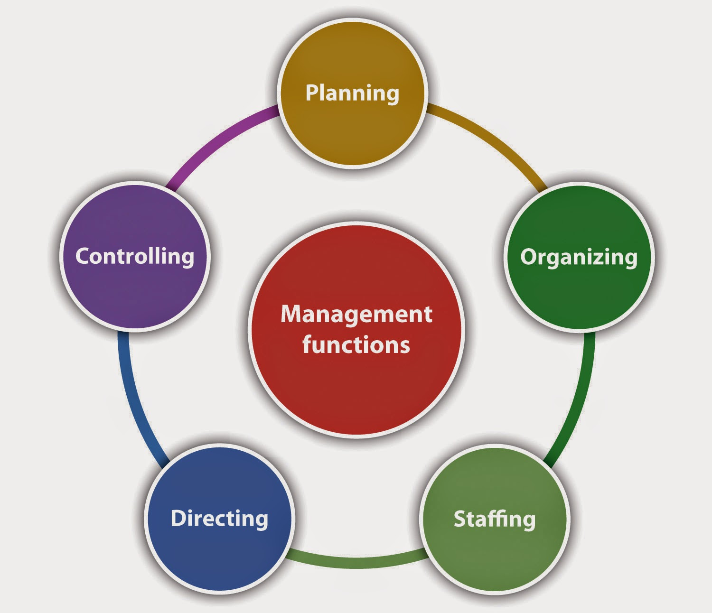

```
                     +--------------------------+
                     |  Network Manager / NMS   |
                     +------------+-------------+
                                  |
                                  v
                     +--------------------------+
                     | Configuration Management |
                     |        System (CMS)      |
                     +------------+-------------+
                                  |
          -------------------------------------------------
          |        |          |         |       |       |
          v        v          v         v       v       v
+----------------+ +----------------+ +----------------+ 
| Device         | | Backup &       | | Change         |
| Inventory      | | Restore        | | Management     |
+----------------+ +----------------+ +----------------+
          |                 |                |
          v                 v                v
+----------------+ +----------------+ +----------------+
| Version        | | Compliance &   | | Provisioning & |
| Control        | | Auditing       | | Deployment     |
+----------------+ +----------------+ +----------------+
                                  |
                                  v
                     +--------------------------+
                     | Monitoring & Reporting   |
                     +--------------------------+
```

---

# **Functions of Configuration Management in Network Management**

Configuration Management (CM) is responsible for **managing network device configurations** to ensure **consistency, reliability, and efficient network operation**. Its functions can be grouped systematically as follows:

---

## **1. Device Inventory Management**

* **Purpose:** Keep a complete record of all network devices, their types, hardware, software versions, and IP addresses.
* **Importance:** Helps network administrators know what devices exist in the network and their current configurations.
* **Example:** A network admin can quickly locate all routers running a specific firmware version.

---

## **2. Configuration Backup and Restore**

* **Purpose:** Regularly save device configurations to prevent data loss.
* **Importance:** Ensures quick recovery in case of device failure or misconfiguration.
* **Key Points:**

  * Automated backup schedules can prevent human errors.
  * Restoring previous versions minimizes network downtime.
* **Example:** If a switch firmware update fails, the previous configuration can be restored.

---

## **3. Change Management**

* **Purpose:** Control and document changes to device configurations.
* **Importance:** Prevents unauthorized or conflicting changes that could disrupt the network.
* **Process Steps:**

  1. Submit a change request.
  2. Review and approve the change.
  3. Implement the change.
  4. Record the change in logs.
* **Example:** Changing VLAN assignments on multiple switches must follow approval to avoid network loops.

---

## **4. Version Control**

* **Purpose:** Maintain a history of configuration changes for all devices.
* **Importance:** Allows rollback to a previous configuration if a new change causes issues.
* **Key Points:**

  * Each configuration is saved as a version.
  * Version control supports troubleshooting and auditing.
* **Example:** If a router’s updated ACL blocks legitimate traffic, admins can revert to the last working configuration.

---

## **5. Compliance and Auditing**

* **Purpose:** Ensure devices adhere to network policies and regulatory standards.
* **Importance:** Reduces security risks and avoids non-compliance penalties.
* **Key Points:**

  * Regular audits compare current configurations with standard templates.
  * Deviations are flagged for correction.
* **Example:** A firewall configuration that doesn’t comply with corporate security policy can be automatically flagged.

---

## **6. Provisioning and Deployment**

* **Purpose:** Automate the configuration of new or updated network devices.
* **Importance:** Saves time and reduces manual errors when adding devices or updating configurations.
* **Key Points:**

  * Use of automation tools like Ansible, Puppet, or Chef.
  * Supports large-scale network expansion.
* **Example:** Deploying a standard VLAN configuration across 50 switches automatically.

---

## **7. Monitoring and Reporting**

* **Purpose:** Continuously monitor configuration status and generate reports.
* **Importance:** Helps administrators quickly detect configuration drift or errors.
* **Key Points:**

  * Alerts for unauthorized or unintended changes.
  * Reports for management or compliance audits.
* **Example:** The system generates a weekly report showing all switches with non-standard configurations.

---

### **Summary Table (for Quick Exam Revision)**

| Function                  | Purpose / Importance                          | Example                                   |
| ------------------------- | --------------------------------------------- | ----------------------------------------- |
| Device Inventory          | Track all devices and software                | List all routers with firmware versions   |
| Backup & Restore          | Prevent configuration loss, quick recovery    | Restore switch config after failed update |
| Change Management         | Control and document changes                  | Approved VLAN change                      |
| Version Control           | Maintain configuration history for rollback   | Revert ACL changes on a router            |
| Compliance & Auditing     | Ensure policy adherence, avoid security risks | Flag firewall non-compliance              |
| Provisioning & Deployment | Automate configuration deployment             | Auto-configure 50 switches                |
| Monitoring & Reporting    | Detect errors, track configuration status     | Weekly config drift report                |

---

This structure hits **all key points for a university answer**: definitions, purpose, importance, examples, and a clear table for revision.

If you want, I can also **draw a clean block diagram showing all these functions and their interactions**—perfect for adding to an answer to **score extra marks**.

Do you want me to make that diagram?
