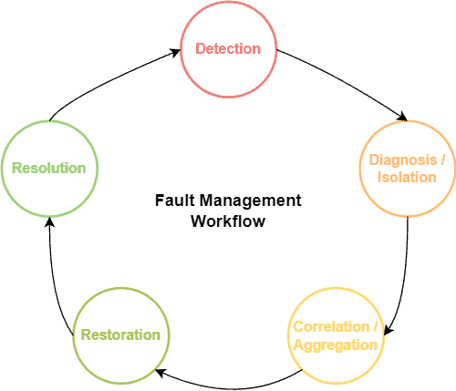

---

# **Fault Management in Network Management**

---

### **1. Definition**

**Fault Management** is a part of **Network Management** that **detects, isolates, and corrects network problems (faults) to maintain normal operation**.

* Its goal is to **ensure network reliability and availability** by identifying failures in devices, links, or services and resolving them quickly.
* It is one of the key functions in **FCAPS (Fault, Configuration, Accounting, Performance, Security)** network management model.

---

### **2. Objectives of Fault Management**

1. **Quick Detection of Faults**

   * Identify network problems as soon as they occur to minimize downtime.

2. **Isolation of Faults**

   * Determine which device, link, or segment is causing the issue.

3. **Correction/Recovery**

   * Fix faults automatically (self-healing networks) or manually.

4. **Recording and Reporting**

   * Maintain logs for troubleshooting, reporting, and analysis.

5. **Proactive Problem Prevention**

   * Predict failures using monitoring and prevent them before they occur.

---

### **3. Functions / Components of Fault Management**

Fault Management involves several **key functions**:

1. **Fault Detection**

   * Discovering when a device, link, or service is not functioning properly.

2. **Fault Isolation / Diagnosis**

   * Determining the **exact source or location** of the fault.

3. **Fault Correction / Recovery**

   * Repairing the fault, e.g., switching to a backup link or resetting a device.

4. **Fault Logging and Notification**

   * Generating **alarms, logs, or notifications** for network administrators.

5. **Performance and Trend Analysis**

   * Analyzing recurring faults to prevent future problems.

---

### **4. Fault Detection: How It Works**

**Fault detection** is the **process of identifying a network problem**. It can be accomplished using several methods:

#### **A. Active Monitoring**

* **Polling Devices:** Network management system (NMS) periodically polls devices using protocols like **SNMP (Simple Network Management Protocol)**.
* **Test Traffic:** Sending test packets (like ICMP ping or traceroute) to verify connectivity.
* **Advantages:** Immediate detection of device or link failures.

#### **B. Passive Monitoring**

* **Trap Messages / Event Notifications:** Devices send alerts (SNMP traps) to NMS when a fault occurs.
* **Example:** Router sends a trap when an interface goes down.
* **Advantages:** Reduces polling overhead; real-time alerts.

#### **C. Threshold-Based Monitoring**

* **Predefined Thresholds:** If metrics like CPU usage, bandwidth, or error rate exceed a threshold, a fault is declared.
* **Example:** If packet loss exceeds 5% on a link, the system flags it as a fault.

#### **D. Log Analysis**

* Devices and servers generate logs that are continuously analyzed for anomalies.
* Can detect errors or trends that might lead to faults.

#### **E. Event Correlation**

* Combines multiple alarms or alerts to identify **root cause** rather than just symptoms.
* **Example:** If multiple switches in a segment report high latency, the system may identify the backbone link as the problem.

---

### **5. Fault Management Process Flow**

A **structured fault management process** can be summarized as follows:

```
Fault Occurrence
       ↓
 Fault Detection (Active/Passive/Threshold)
       ↓
  Alarm Generation & Notification
       ↓
   Fault Isolation / Diagnosis
       ↓
   Fault Correction / Recovery
       ↓
 Logging & Reporting
       ↓
 Trend Analysis & Preventive Actions
```

---

### **6. Fault Management Tools & Protocols**

* **SNMP (Simple Network Management Protocol):** Used for monitoring and traps.
* **Syslog Servers:** Centralized logging for analyzing faults.
* **Ping / Traceroute / ICMP:** For connectivity and latency checks.
* **Network Monitoring Tools:** Nagios, Zabbix, SolarWinds, PRTG, etc.

---

### **7. Importance / Benefits of Fault Management**

* **Ensures high availability and reliability** of network services.
* **Reduces downtime** by quick detection and resolution of faults.
* **Improves user satisfaction** and productivity.
* **Provides data for preventive maintenance**, avoiding repeated failures.
* **Helps in planning network upgrades** based on recurring faults.

---

### **8. Summary Table (Exam-Friendly)**

| Aspect                      | Details                                                                            |
| --------------------------- | ---------------------------------------------------------------------------------- |
| **Definition**              | Detects, isolates, and corrects network faults to maintain normal operation        |
| **Objectives**              | Quick detection, isolation, correction, logging, proactive prevention              |
| **Functions**               | Fault detection, isolation, correction, logging, trend analysis                    |
| **Fault Detection Methods** | Active monitoring, passive monitoring, thresholds, log analysis, event correlation |
| **Tools/Protocols**         | SNMP, Syslog, Ping, Traceroute, Network Monitoring Tools                           |
| **Benefits**                | High availability, reduced downtime, preventive maintenance, better planning       |

---

### ✅ **Tip for Exams**

* Draw a **fault management flow diagram**:

```
Fault Occurs → Detection → Alarm → Isolation → Correction → Logging → Trend Analysis
```

This **plus the table** makes a **complete answer**.

---
