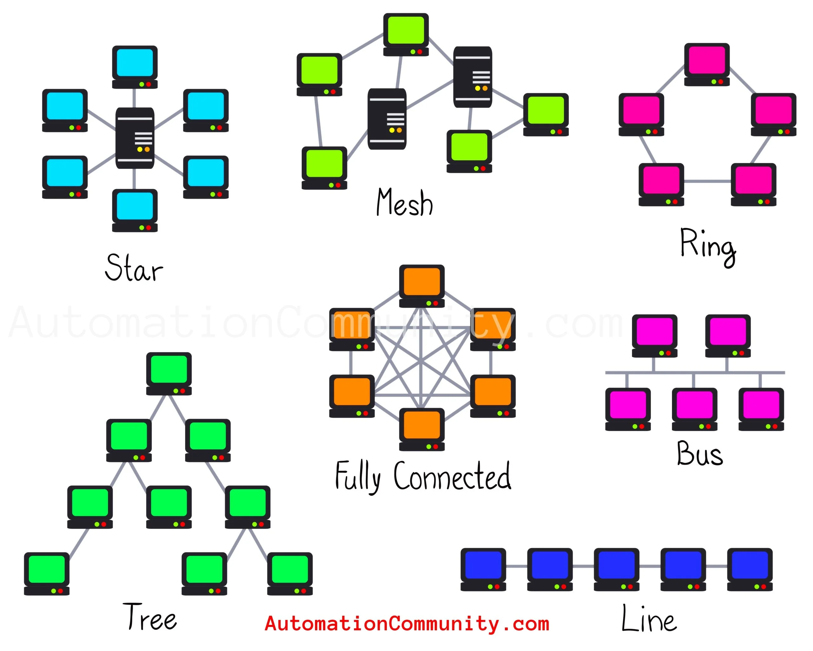

```
                        +----------------+
                        |  Network       |
                        |  Topology      |
                        +--------+-------+
                                 |
        -------------------------------------------------
        |        |        |        |         |         |
     Bus      Star     Ring      Mesh      Tree     Hybrid
     +        +        +         +         +         +
     |        |        |         |         |         |
 Devices  Central   Circular  Fully     Hierarchical  Combination
 Connected Hub      Loop      Connected  Branches     of Others
 to Single            Devices    Devices
 Backbone
```


---

# **Network Topology**

---

### **1. Definition**

**Network Topology** is the **physical or logical arrangement of devices (nodes) and connections (links) in a computer network**.

* It determines **how devices communicate**, **how data flows**, and **how the network performs and scales**.
* Topology affects **network efficiency, reliability, scalability, and cost**.

There are **two types of network topology**:

1. **Physical Topology** – How cables, devices, and hardware are physically connected.
2. **Logical Topology** – How data flows in the network, independent of physical layout.

---

### <span style="color: yellow;">**2. Network Topology Services**</span>
Network topologies provide several **key services** to support network management:

1. **Data Transmission Service**

   * Ensures devices can **communicate reliably** and efficiently.

2. **Error Detection and Correction**

   * Supports **fault-tolerant communication** by enabling error checking and recovery.

3. **Routing and Switching Service**

   * Determines the **path data takes** from source to destination.

4. **Network Management Service**

   * Supports **monitoring, configuration, and maintenance** of devices.

5. **Scalability Service**

   * Allows the network to **grow** without performance degradation.

6. **Fault Tolerance and Reliability**

   * Minimizes downtime by providing **redundant paths** or recovery mechanisms.

---

### **3. Types of Network Topology**

Network topologies are classified based on **how nodes are arranged and connected**. Each has **advantages and disadvantages**.

#### **A. Bus Topology**

* **Structure:** Single central cable (backbone) with all devices connected.
* **Data Flow:** Data sent by one device travels along the bus; all devices receive it, but only the intended device processes it.
* **Advantages:**

  * Easy to implement.
  * Requires less cabling than star or mesh.
* **Disadvantages:**

  * Single point of failure (if backbone fails, network fails).
  * Performance degrades with more devices.

---

#### **B. Star Topology**

* **Structure:** All devices connect to a central hub/switch.
* **Data Flow:** Data passes through the central device to reach the destination.
* **Advantages:**

  * Easy to manage and troubleshoot.
  * Failure of one device doesn’t affect others.
* **Disadvantages:**

  * Central hub is a single point of failure.
  * Requires more cabling than bus.

---

#### **C. Ring Topology**

* **Structure:** Devices connected in a circular loop; each device connected to two neighbors.
* **Data Flow:** Data travels in one or both directions around the ring.
* **Advantages:**

  * Predictable performance.
  * Suitable for high-speed LANs using token passing.
* **Disadvantages:**

  * A break in the ring can disrupt the network (unless a dual ring is used).

---

#### **D. Mesh Topology**

* **Structure:** Every device is connected to every other device.
* **Data Flow:** Multiple paths exist between devices.
* **Advantages:**

  * High fault tolerance (alternate paths available).
  * Excellent reliability and redundancy.
* **Disadvantages:**

  * Very expensive and complex for large networks.
  * Requires a lot of cabling.

---

#### **E. Tree (Hierarchical) Topology**

* **Structure:** Combination of star and bus; groups of star networks connected via a backbone.
* **Data Flow:** Follows hierarchy from central backbone to branches.
* **Advantages:**

  * Scalable and easy to manage.
  * Fault isolation is easy.
* **Disadvantages:**

  * Backbone failure affects entire branches.
  * More cabling required than simple bus.

---

#### **F. Hybrid Topology**

* **Structure:** Combination of two or more topologies (e.g., star-ring, star-bus).
* **Advantages:**

  * Flexible and scalable.
  * Can leverage strengths of multiple topologies.
* **Disadvantages:**

  * Complex design and higher cost.

---

### **4. Comparison Table (Quick Exam Reference)**

| Topology Type | Structure       | Advantages                     | Disadvantages                         | Use Case                         |
| ------------- | --------------- | ------------------------------ | ------------------------------------- | -------------------------------- |
| Bus           | Single backbone | Easy, low cost                 | Single point failure, limited devices | Small networks                   |
| Star          | Devices to hub  | Easy to manage, isolate faults | Hub is single point of failure        | LANs, offices                    |
| Ring          | Circular        | Predictable performance        | Break affects network                 | Token Ring LANs                  |
| Mesh          | Fully connected | Fault-tolerant, reliable       | Expensive, complex                    | Critical networks, WAN backbones |
| Tree          | Hierarchical    | Scalable, easy management      | Backbone failure affects branches     | Large organizations              |
| Hybrid        | Mixed           | Flexible, scalable             | Complex, expensive                    | Enterprise networks              |

---

### **5. Summary**

* **Network Topology** defines the **layout and communication path** of devices.
* **Services provided by topology** include data transmission, error handling, routing, scalability, and reliability.
* **Choice of topology** depends on network size, cost, reliability, and performance requirements.
* Modern enterprise networks often use **hybrid topologies** to combine the benefits of multiple types.

---
